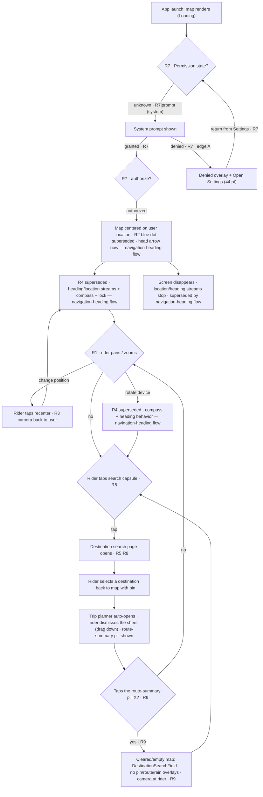

# Flow — Maps Screen

## 1. Related Docs

| Type | Path | Purpose |
|---|---|---|
| Spec | `docs/specs/maps-screen.md` | Requirements, data (no models), rules, constraints, acceptance criteria |
| Design | `docs/designs/maps-screen.md` | Screens, layout, components, accessibility, motion |
| Spec | `docs/specs/navigation-heading.md` | Supersedes R2/R4 of this spec (feat/navigation-icon) — head arrow, custom gyro compass, heading lock |
| Design | `docs/designs/navigation-heading.md` | Compass/blue-dot design superseded — arrow, lock button, custom gyro compass |
| Flow | `docs/flows/navigation-heading.md` | The heading/compass/lock journey (replaces steps 4, 7–10 below) |

## 2. Flow Goal

- User goal: open the app and immediately see an interactive map at their location, easily orient it, and reach the search entry point.
- Start state: app launch; no location permission decision yet.
- End state: map at user location, head arrow at the rider's position (replaces the blue dot — see `docs/flows/navigation-heading.md`), controls available; search tap opens the destination search page.
- Success outcome: rider can pan/zoom freely, tap recenter to return to their position, and reach the search entry point — all without ever leaving the map screen. (The custom compass + blue dot are superseded by `docs/flows/navigation-heading.md`.)

## 3. Spec Coverage

| Spec ID | Requirement | Covered In Flow Step |
|---|---|---|
| R1 | Interactive map (pan/zoom, full-screen) | Steps 1, 5 |
| R2 | User-location dot (no cone) | Step 3 · **superseded** — see `docs/flows/navigation-heading.md` |
| R3 | Recenter-to-location button | Steps 6, 9 |
| R4 | Compass (heading, always visible, cardinal letters, tap reset) | Steps 4, 7–10, 13 · **superseded** — see `docs/flows/navigation-heading.md` |
| R5 | Search bar (opens search page) | Step 11 |
| R7 | Permission states | Steps 1–3, Edge case A |
| R8 | Accessibility (44 pt, VoiceOver, Dynamic Type, Reduce Motion) | Step 11 (announcement); controls on all steps |
| R9 | Clear restores the empty/search map (pill X / destination-row X) | Step 12, Edge case E |

## 4. Design Coverage

| Design Section | Screen / State | Used In Flow Step |
|---|---|---|
| Design §1 | Loading | Step 1 |
| Design §1 | Permission requested (system) | Step 2 |
| Design §1 | Loaded | Step 3 |
| Design §1 | Denied | Edge case A |
| Design §1 | Search page entry | Step 11 |
| Design §1 | Cleared/empty | Step 12, Edge case E |
| Design §2 | Layout (capsule, control stack, compass) | Steps 3, 6–12 · compass superseded — `docs/designs/navigation-heading.md` |
| Design §6 | Motion (dial, Reduce Motion) | Steps 6–12 · dial superseded — `docs/designs/navigation-heading.md` |

## 5. Main User Journey

1. App launches → map renders (Loading, R7).
2. Permission state unknown → native prompt asks for when-in-use location (R7).
3. Authorized → map centers on user location (R7). The blue dot via `UserAnnotation` is **superseded** — the head arrow now shows the position (see `docs/flows/navigation-heading.md` step 3).
4. **Superseded (R4 → `docs/flows/navigation-heading.md`):** heading + location streams now start on authorize and stop on disappear for the head arrow and lock state; this step is kept as history.
5. Rider pans and zooms the map with standard gestures (R1).
6. Rider taps the recenter button → camera returns to user location (R3).
7. **Superseded (R4 → `docs/flows/navigation-heading.md`):** the custom compass dial and its rotation now live in the navigation-heading flow (custom gyro compass — always visible, needle = phone heading, decorative — + heading-lock button); this step is kept as history.
8. **Superseded (R4 → `docs/flows/navigation-heading.md`):** `trueHeading`/`magneticHeading` selection and the ≥ 180° outlier drop now feed the head arrow's rotation; this step is kept as history.
9. **Superseded (R4 → `docs/flows/navigation-heading.md`):** the compass-tap north-up + recenter reset is gone — the custom gyro compass is not tappable; reorient happens via `RecenterButton` / unlocking; this step is kept as history.
10. **Superseded (R4 → `docs/flows/navigation-heading.md`):** heading updates stop on disappear — now location + heading streams stop on disappear; this step is kept as history.
11. Rider taps the search capsule → destination search page opens (R5, R8).
12. After a destination is cleared from the route-summary pill X or the trip planner destination-row X (trip-planner R17/R18), the map returns to the empty/search state: `DestinationSearchField` ("Your Destination…") visible, no destination pin/route/rain overlays, camera at the rider's location (R9).

## 6. Edge Cases

- **A. Denied permission:** system prompt denied → denied overlay with explanation + Open Settings (44 pt) (R7). Tap Open Settings → Settings app; on return the state re-checks and either goes to Loaded or shows the overlay again.
- **B. No heading data yet:** map loads; **superseded** — the head arrow stays upright (rotation 0) until the first heading sample (see `docs/flows/navigation-heading.md` edge A).
- **C. Heading sample outlier (≥ 180° jump):** sample dropped, keeps the last value — now feeds the arrow, not a dial (see `docs/flows/navigation-heading.md` edge H).
- **D. Search tap while denied:** still opens the search page — no new prompt (R5).
- **E. Clear from the route-summary pill (or the trip planner destination row):** tapping the pill's X clears the destination immediately, with no confirmation, and returns the map to the cleared/empty state — `DestinationSearchField` visible, no pin/route/rain overlays, camera at the rider's location; the reset scope and retained trip values live in `docs/specs/trip-planner.md` §5 (R9; trip-planner R17/R18). While weather is loading the blocking overlay covers the pill, so the pill X is unreachable until the fetch ends (accepted limitation).

## 7. Flow Diagram

