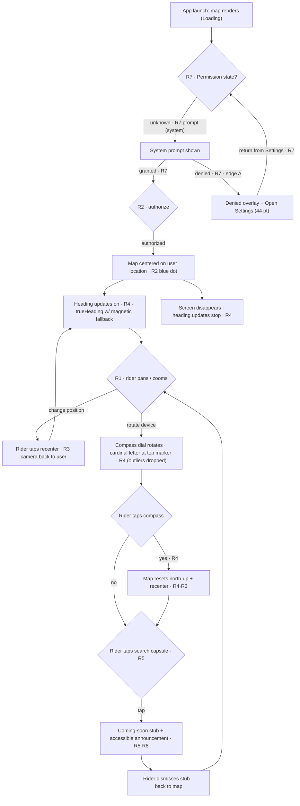

# Flow — Maps Screen

## 1. Related Docs

| Type | Path | Purpose |
|---|---|---|
| Spec | `docs/specs/maps-screen.md` | Requirements, data (no models), rules, constraints, acceptance criteria |
| Design | `docs/designs/maps-screen.md` | Screens, layout, components, accessibility, motion |

## 2. Flow Goal

- User goal: open the app and immediately see an interactive map at their location, easily orient it, and reach the search entry point.
- Start state: app launch; no location permission decision yet.
- End state: map at user location, blue dot visible, controls available; search tap shows the coming-soon stub.
- Success outcome: rider can pan/zoom freely, tap recenter to return to their position, read the compass (cardinal letters rotate with device heading), and tap it to reset to north-up — all without ever leaving the map screen.

## 3. Spec Coverage

| Spec ID | Requirement | Covered In Flow Step |
|---|---|---|
| R1 | Interactive map (pan/zoom, full-screen) | Steps 1, 5 |
| R2 | User-location dot (no cone) | Step 3 |
| R3 | Recenter-to-location button | Steps 6, 9 |
| R4 | Compass (heading, always visible, cardinal letters, tap reset) | Steps 4, 7–10, 13 |
| R5 | Search bar (visual + tap stub) | Step 11 |
| R7 | Permission states | Steps 1–3, Edge case A |
| R8 | Accessibility (44 pt, VoiceOver, Dynamic Type, Reduce Motion) | Step 11 (announcement); controls on all steps |

## 4. Design Coverage

| Design Section | Screen / State | Used In Flow Step |
|---|---|---|
| Design §1 | Loading | Step 1 |
| Design §1 | Permission requested (system) | Step 2 |
| Design §1 | Loaded | Step 3 |
| Design §1 | Denied | Edge case A |
| Design §1 | Search stub | Step 11 |
| Design §2 | Layout (capsule, control stack, compass) | Steps 3, 6–12 |
| Design §6 | Motion (dial, Reduce Motion) | Steps 6–12 |

## 5. Main User Journey

1. App launches → map renders (Loading, R7).
2. Permission state unknown → native prompt asks for when-in-use location (R7).
3. Authorized → map centers on user location; blue dot shown via `UserAnnotation` (R2, R7).
4. `MapViewModel` starts heading updates (R4 — authorized + screen visible only).
5. Rider pans and zooms the map with standard gestures (R1).
6. Rider taps the recenter button → camera returns to user location (R3).
7. Compass sits visible top-trailing; rider rotates the device → dial rotates so the letter for the heading faces the top marker (R4).
8. `trueHeading` drives the dial; `magneticHeading` fallback; outlier jumps ≥ 180° dropped (R4).
9. Rider taps compass → map resets to north-up + recenters to user location (R4, R3).
10. Screen disappears → heading updates stop (R4).
11. Rider taps the search capsule → coming-soon stub, accessible announcement (R5, R8).

## 6. Edge Cases

- **A. Denied permission:** system prompt denied → denied overlay with explanation + Open Settings (44 pt) (R7). Tap Open Settings → Settings app; on return the state re-checks and either goes to Loaded or shows the overlay again.
- **B. No heading data yet:** map loads with dot; compass shows the dial upright (N at the top marker) until the first heading sample (R4).
- **C. Heading sample outlier (≥ 180° jump):** sample dropped, dial keeps last value (R4).
- **D. Search tap while denied:** still shows the stub — no new prompt (R5).

## 7. Flow Diagram

