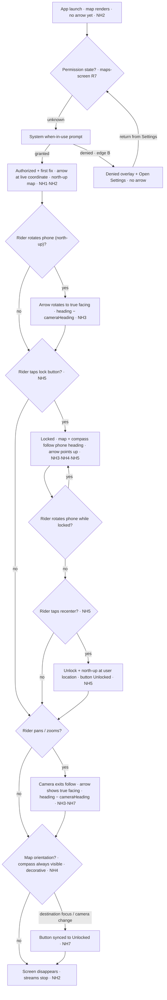

# Flow — Navigation Heading

## 1. Related Docs

| Type | Path | Purpose |
|---|---|---|
| Spec | `docs/specs/navigation-heading.md` | Requirements NH1–NH8, data (none), rules, constraints, acceptance |
| Design | `docs/designs/navigation-heading.md` | Screens/states, layout, components, accessibility, motion |
| Spec | `docs/specs/maps-screen.md` | Map screen home (R2 blue dot / R4 custom compass superseded by this feature) |
| Design | `docs/designs/maps-screen.md` | Map screen design (compass/blue-dot sections superseded) |

## 2. Flow Goal

- User goal: while riding, glance at the phone and instantly know which way they face (head arrow) and whether the map follows the phone's heading (custom gyro compass + lock button); one tap locks/unlocks or recenters.
- Start state: app launch; map rendering; no location permission decision yet.
- End state: map at user location with head arrow; lock state synced with the real camera; streams stopped on disappear.
- Success outcome: the rider rotates the phone and the map either stays north-up with the arrow showing true facing, or follows the heading once locked — and can always unlock/recenter in one tap.

## 3. Spec Coverage

| Spec ID | Requirement | Covered In Flow Step |
|---|---|---|
| NH1 | Head arrow replaces the `UserAnnotation` blue dot | Steps 3–4 |
| NH2 | Arrow follows continuous location while visible; streams stop on disappear | Steps 3, 11, edges B, C |
| NH3 | Arrow rotation = heading − camera heading | Steps 4, 6, 8, edges A, F, H |
| NH4 | Custom gyro compass, always visible at the top of the bottom-trailing control stack, decorative (not tappable) | Steps 4, 6, 9 |
| NH5 | Lock button toggles followsHeading; recenter while locked = unlock + north-up | Steps 5, 7 |
| NH6 | No new Info.plist keys | Step 2 |
| NH7 | Lock-state sync from camera (pan / destination focus) | Steps 8–10, edges D, E, G |
| NH8 | Accessibility per 004 (VO label/value/hint, 44 pt, shape change + value, Reduce Motion) | All steps |

## 4. Design Coverage

| Design Section | Screen / State | Used In Flow Step |
|---|---|---|
| Design §1 | Loading (no fix yet) | Step 1, edge C |
| Design §1 | Authorized + fix (north-up) | Step 3 |
| Design §1 | Locked | Steps 5–6 |
| Design §1 | Unlocked + manually rotated | Step 8 |
| Design §1 | Heading unavailable | Edge A |
| Design §1 | Denied | Edge B |
| Design §2 | Layout (arrow, compass, control stack, landscape) | Steps 3–10 |
| Design §3 | HeadingArrowView / HeadingLockButton / MapCompassOverlay / NeedleView | Steps 3–10 |
| Design §5 | VO labels, shape change + value, 44 pt, Reduce Motion | All steps |
| Design §6 | Motion (0.2 s eased arrow, instant Reduce Motion) | Steps 4–9 |

## 5. Main User Journey

1. App launches → map renders; no arrow yet (Loading state; NH2).
2. Location permission unknown → native when-in-use prompt (existing maps-screen R7 flow); no new key (NH6).
3. Authorized + first fix → head arrow appears at the live coordinate on the north-up map (NH1, NH2).
4. Rider rotates the phone while the map is north-up → the arrow rotates to true facing (`heading − 0`); the compass stays always visible with the needle showing the phone heading (NH3, NH4).
5. Rider taps the lock button → camera becomes `.userLocation(followsHeading: true)`; button value "Locked" (NH5, NH7).
6. While locked, rotating the phone rotates the map with it; the compass needle keeps showing the phone heading (visually coherent); the arrow points up (`heading − cameraHeading ≈ 0`) (NH3, NH4).
7. Rider taps recenter while locked → the lock clears and the map returns north-up at the user's location; button value "Unlocked" (NH5).
8. Rider pans the map → the camera exits the follow position; the arrow shows true facing via `heading − cameraHeading`; the button stays "Unlocked" (NH3, NH7).
9. The compass is always visible at the top of the bottom-trailing control stack; the needle shows the phone heading; it is not tappable — reorient happens via `RecenterButton`/lock, not the compass; `syncFollowHeading` keeps the button honest (NH4, NH7).
10. A destination focus or any other camera change → `.onChange(of: cameraPosition)` → `syncFollowHeading(newPosition.followsUserHeading)` keeps the button in sync (NH7).
11. Screen disappears → location + heading streams stop (NH2).
12. Denied permission → existing overlay; no arrow (NH8; maps-screen R7).

## 6. Edge Cases

- **A. Heading unavailable (simulator / no compass):** the arrow stays upright (rotation 0); VO reads "Your location" without a cardinal value (NH3, NH8).
- **B. Denied permission:** existing overlay + Open Settings; no arrow; streams never start (NH2).
- **C. No fix yet:** map renders with controls; no arrow until the first location sample (NH1).
- **D. Pan while locked:** the camera exits `followsHeading`; `.onChange(of: cameraPosition)` flips the button to "Unlocked" — the button never lies (NH7).
- **E. Destination focus while locked:** focusing a destination changes the camera → `followsUserHeading` false → button "Unlocked"; the follow camera is not re-applied until the rider re-locks (NH7).
- **F. Simulator emits no heading:** the arrow never rotates (rotation 0) but the lock button still works — locked mode simply shows no rotation (NH3).
- **G. Compass while locked:** the compass is decorative (not tappable) — no compass-tap path exists; lock-state sync sources are pan and destination focus only, via `.onChange(of: cameraPosition)` → `syncFollowHeading` (NH4, NH7).
- **H. Heading jump ≥ 180° (crossing artifact):** dropped by the existing heading smoothing before it reaches the arrow (NH3).

## 7. Flow Diagram

