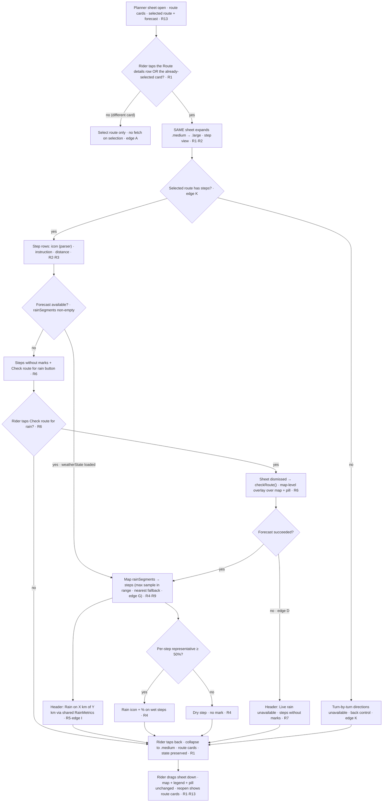

# Flow — Route Detail

## 1. Related Docs

| Type | Path | Purpose |
|---|---|---|
| Spec | `docs/specs/route-detail.md` | Requirements, data model, rules, constraints, acceptance criteria |
| Design | `docs/designs/route-detail.md` | Screens, layout, components, accessibility, motion |
| Spec | `docs/specs/trip-planner.md` | The planner sheet the step view expands (R1, R13) |
| Spec | `docs/specs/weather-forecast.md` | The `rainSegments` + ≥ 50% wet concept the rain marks reuse (R4, R5) |

## 2. Flow Goal

- User goal: before starting, glance at the selected route's turn-by-turn steps and see which turns are wet, plus how much of the ride is rained on — then go back and start.
- Start state: trip-planner sheet open with a planned route (`state == .loaded`), a selected route card, route cards + polylines on the map.
- End state: the same planner sheet expanded to `.large` showing the step list with rain marks on wet steps and the header wet-distance summary (or the checking / no-forecast / unavailable / empty-steps variant); back returns to the route cards with all state intact.
- Success outcome: the rider taps the "Route details" row (or re-taps the selected card as a shortcut), reads the wet-step preview, and returns to the route cards — with origin/destination/stop/selection/departure untouched and no weather ever fetched without an explicit tap.

## 3. Spec Coverage

| Spec ID | Requirement | Covered In Flow Step |
|---|---|---|
| R1 | "Route details" row is the primary entry (re-tap of the selected card = shortcut) expands same sheet (`.medium`→`.large`), back returns; state preserved | Steps 1–2, 5, 10, edges A, B |
| R2 | Step list: icon + instruction + distance per step, ordered | Steps 2–3 |
| R3 | `RouteTurnType` English instruction parser (13 cases, ordered) | Steps 2–3, edge E |
| R4 | Rain marks on wet steps (≥ 50%, max sample in range); dry steps show neither | Steps 3–4, edges F–H |
| R5 | Header wet summary via shared `RainMetrics` (same as map legend) | Steps 3–4, 6, edges F–I |
| R6 | No forecast → "Check route for rain" dismisses the sheet then `checkRoute()` (overlay); no silent auto-fetch | Steps 6–8, edge C |
| R7 | Weather unavailable → "Live rain unavailable" note in header | Edge D |
| R8 | Stop routes concatenate both legs' steps with continuous distances | Step 9, edge J |
| R9 | Distance alignment + nearest-sample fallback for the rain→step mapping | Steps 3–4, edge G |
| R10 | MVVM: `RouteStep`/`RouteTurnType`; `DirectionsService` builds steps; VM maps rain→steps | Steps 2–4 |
| R11 | Accessibility (44 pt, VO, Dynamic Type, Reduce Motion, non-color-only) | Steps 1–10 |
| R12 | Docs updated | This doc |
| R13 | Preview only; no live nav / background location / voice; no step-tap highlight | Steps 1–10 |

## 4. Design Coverage

| Design Section | Screen / State | Used In Flow Step |
|---|---|---|
| Design §1 | Route cards (entry point — "Route details" row) | Steps 1–2 |
| Design §1 | Detail loaded with wet steps | Steps 3–4 |
| Design §1 | Checking rain | Step 7 |
| Design §1 | No forecast (idle) | Step 6 |
| Design §1 | Weather unavailable | Edge D |
| Design §1 | Empty steps | Edge K |
| Design §1 | Back to cards | Steps 5, 10 |
| Design §2 | Step view layout (header row, summary row, step list, bottom button) | Steps 2–8 |
| Design §3 | RouteDetailSheet / RouteStepRow / RouteTurnType icons | Steps 2–8 |
| Design §3 | Modified RouteCard (re-tap) / TripPlannerSheet (detent + mode) | Steps 1–2, 5, 10 |
| Design §5 | VoiceOver labels, non-color-only, 44 pt, Dynamic Type, Reduce Motion | Steps 1–10 |
| Design §6 | System detent motion / Reduce Motion | Steps 1, 2, 5, 7, 10 |

## 5. Main User Journey

1. Rider taps "Check Route" (or auto-plans on destination pick) → routing + forecast finish; route cards render, the map shows colored rain segments, and the planner sheet shows the "Route details" row below the cards (R13; trip-planner R1).
2. Rider taps the **"Route details" row** (primary entry; re-tapping the **already-selected** route card is a shortcut) → the SAME planner sheet expands `.medium` → `.large` (system detent animation); the step view appears: back chevron · "Route details" · summary row · step list (R1, R2).
3. Each step renders a `RouteStepRow`: turn icon (from the English instruction parser), instruction text, distance; `DirectionsService` built the steps from `MKRoute.steps`, distance-aligned to the route (R2, R3, R9, R10).
4. The step view maps the existing 5 km `rainSegments` onto each step (max sample in the step's range; nearest-sample fallback); steps with representative chance ≥ 50% show `cloud.rain.fill` + "%"; dry steps show neither (R4, R9).
5. Rider taps the back chevron → step view collapses to the route cards (detent `.medium`); origin/destination/stop/selection/departure preserved; no re-route, no re-fetch (R1).
6. If the forecast was never fetched (`weatherState == .idle`), the step view shows steps without marks + a full-width "Check route for rain" button (R6).
7. Rider taps "Check route for rain" → the planner sheet dismisses first, then the existing `checkRoute()` runs routing + weather; the map-level blocking overlay covers the map and the pill while the forecast computes; step marks withheld; on routing failure while dismissed, the map re-presents the sheet (R6).
8. The forecast attaches → the header shows the wet-distance summary "Rain on X km of Y km" and wet steps gain their marks (R4, R5, R6).
9. If the route has a stop, the step list is the concatenation of both legs' steps with continuous cumulative distances (the leg boundary steps appear in order) (R8).
10. Rider drags the sheet down to dismiss (or taps back and drags) → the map keeps the colored route + legend; the route-summary pill behaves as in trip-planner; reopening the sheet returns to the route cards with trip state intact (R1, R13).

## 6. Edge Cases

- **A. Tapping a different (non-selected) card:** only selects the route (existing behavior) — no expansion; if that route has no cached segments, it shows no forecast (`.idle`) until Check Route — selection never fetches (R1; weather-forecast R7).
- **B. Back before reading the summary:** back at any point returns to the route cards; no re-route and no weather fetch ever runs on back (R1, R6).
- **C. Check route for rain tapped twice:** the sheet dismisses on the first tap, then `checkRoute()` cancels any in-flight task and restarts (existing behavior); the map-level overlay stays until the new result or failure lands (R6).
- **D. Weather failure while in the step view:** the fetch throws → `weatherState = .unavailable` → the header note "Live rain unavailable" replaces the summary; steps stay without marks; plan not failed (R7).
- **E. Non-English instructions:** the English-only parser yields `other` (generic `arrow.up` icon); the instruction text is still shown verbatim; no crash (R3).
- **F. Fully dry route:** the summary reads "Rain on 0 km of Y km"; no step shows a mark (R5).
- **G. Short step with no 5 km sample inside its range:** the nearest sample (by `distanceFromStart` to the step's midpoint) is the step's representative chance, so no step is silently unmarked (R9).
- **H. Fully wet route:** the summary reads "Rain on Y km of Y km"; every step shows a rain mark (R4, R5).
- **I. Map legend vs. header disagreement impossible:** both the legend and the header call `RainMetrics.wetDistance(for:)` with identical km formatting — no drift (R5).
- **J. Stitched stop route:** steps = first leg's steps + second leg's steps; cumulative distances continue across the boundary so the rain→step mapping stays correct for the whole trip (R8, R9).
- **K. Empty steps:** `MKRoute.steps` empty (or the parser produced none) → "Turn-by-turn directions unavailable for this route" replaces the list; the back control stays (R1).
- **L. Reduce Motion:** the `.medium` → `.large` expansion and back collapse use the system detent transition; step rows and rain marks appear instantly (R11).
- **M. Weather loading from the route-card view:** "Check route for rain" dismisses the sheet, so the map-level blocking overlay covers the map and the pill (existing `WeatherLoadingOverlay`); the step view's own checking state only appears if the rider reopens the sheet while the forecast is still computing (R6).
- **N. Very long route:** the step list scrolls vertically; rows stay ≥ 44 pt and Dynamic Type scales are handled by wrapping + scrolling (R11).
- **O. Re-route while the step view is open:** impossible from the step view (trip controls are behind the back control); if a re-route happens from elsewhere, `plan()` resets weather to idle and the step view shows the no-forecast affordance for the re-planned selected route (R6).

## 7. Flow Diagram

