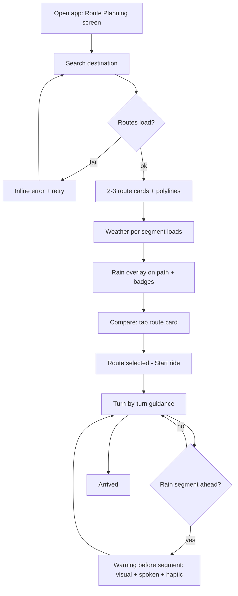

# Flow — Route Rain Overlay (Apple Maps UI/UX)

## 1. User Journey

1. Rider opens the app → Route Planning screen (map + search field).
2. Types/searches a destination (or picks a recent one) → app requests routes.
3. 1–3 route alternatives appear: polylines on the map + route cards with ETA and distance.
4. Rain data loads per route segment → rain overlay paints the path; cards show "Driest" badge or "Rain ahead" + wet-distance summary (fastest route).
5. Rider compares at a glance and taps a card to select → polyline highlights.
6. Optionally reads the departure-time suggestion (P1) and adjusts when to leave.
7. Taps "Start ride" → turn-by-turn guidance begins.
8. Approaching a rainy segment: warning fires before the rider reaches it (visual + spoken + haptic).
9. Rider arrives; ride ends. End state: arrived confirmation.

## 2. Flow Diagram

The data flow behind this journey is the embedded diagram in `docs/specs/route-rain-overlay.md` §3 (Destination → MKDirections → 2–3 routes → ~1 km sampling → WeatherKit + Core ML → per-segment rain chance + ETA → route cards + overlay). The user journey above traces to it as follows, and the screens implementing each stage are in `docs/designs/route-rain-overlay.md` §2:

## 3. Events & State Changes

App-level states (behavior, not code):

| Event | State change |
|---|---|
| App opens | idle → map + search ready |
| Search submitted | → loading routes (skeleton cards) |
| Routes received | → loaded (cards + polylines) |
| Weather arrives per segment | → loaded + rain overlay fade-in; "live rain unavailable" banner instead if weather fails (R8) |
| Route card tapped | selected route highlighted; "Start ride" enabled |
| Start ride tapped | → navigating (guidance banner) |
| Rain segment within warning distance | → approaching-rain warning (banner + spoken + haptic), then back to navigating |
| Arrival | → arrived confirmation + haptic |
| Weather refresh / departure time change | segment chances recomputed, cache invalidated (R9) |

Each event traces to a spec requirement: search→R1, overlay→R2, badges→R3/R4/R5, departure time→R7, offline→R8, refresh→R9, warnings→R6.

## 4. Edge Cases

- **Offline / weather unavailable**: routes render without overlay + "live rain unavailable" note; flow continues to Start ride (R8; spec-guide §8)
- **Location permission denied**: routes still searchable from typed destination; no "current location" shortcut; no crash
- **No destination match**: "No places found" empty state under the search field
- **Route request failure**: inline retry card; map stays usable
- **Rapid navigation**: search while cards are loading cancels stale requests; latest query wins
- **Very long routes**: sampling ~1 km bounded by route length; overlay may arrive after cards (staggered fade-in) — cards always show first
- **Departure time changed**: segment chances refresh from cache-invalidated weather (R9); overlay re-colors
- **App backgrounded mid-ride**: guidance resumes on foreground; missed rain warning fires immediately if the segment is now near