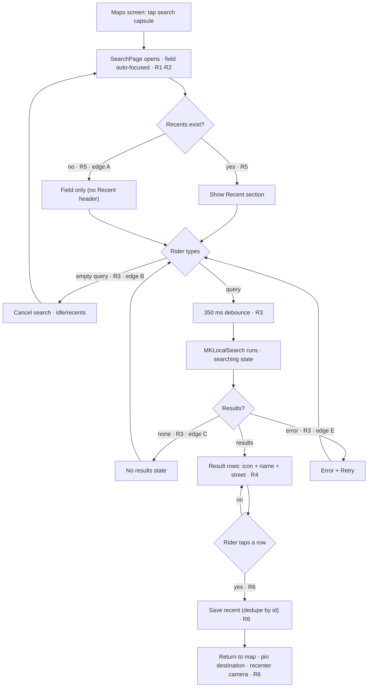

# Flow — Destination Search

## 1. Related Docs

| Type | Path | Purpose |
|---|---|---|
| Spec | `docs/specs/search.md` | Requirements, data model, rules, constraints, acceptance criteria |
| Design | `docs/designs/search.md` | Screens, layout, components, accessibility, motion |

## 2. Flow Goal

- User goal: search for a destination by name, pick it, and have it pinned on the map with the camera recentered.
- Start state: maps screen with the search capsule visible.
- End state: back on the maps screen with a destination pin and camera recentered; the selection saved as a recent.
- Success outcome: rider types, sees results, taps one, and is returned to a map focused on that destination — with recents populated for next time.

## 3. Spec Coverage

| Spec ID | Requirement | Covered In Flow Step |
|---|---|---|
| R1 | Search page as a modal sheet | Step 1 |
| R2 | Search field (magnifier, placeholder, mic, in-field clear X) + trailing close | Steps 1–2 |
| R3 | Live MapKit search while typing | Step 3 |
| R4 | Result row (icon + name + street) | Step 4 |
| R5 | Recent header only when recents exist | Steps 2, 5 |
| R6 | Save recent, return, pin, recenter | Step 5 |
| R7 | Accessibility | Steps 1, 4, 5 |

## 4. Design Coverage

| Design Section | Screen / State | Used In Flow Step |
|---|---|---|
| Design §1 | Idle | Step 2 |
| Design §1 | Searching | Step 3 |
| Design §1 | Loaded | Step 4 |
| Design §1 | Empty | Edge case C |
| Design §1 | Error | Edge case E |
| Design §3 | Components | Steps 2–5 |

## 5. Main User Journey

1. Rider taps the search capsule on the maps screen → `SearchPage` opens as a modal sheet, field auto-focused; trailing close button dismisses the sheet at any time (R1, R2, R7).
2. Idle: field shows "Your Destination…"; if recents exist, a "Recent" section lists them (R2, R5). No query yet.
3. Rider types → 350 ms debounce → `MKLocalSearch` runs; ProgressView while searching (R3).
4. Results appear as rows: circular category icon + bold name + secondary-gray street; VoiceOver reads "<name>, <street>" (R4, R7).
5. Rider taps a result → saved as recent, page returns to map, destination pin added, camera recenters to it (R6, R7).

## 6. Edge Cases

- **A. No recents:** "Recent" section and header hidden entirely; page shows only the field (idle) (R5).
- **B. Empty query:** search cancelled; returns to idle/recents; no results list (R3).
- **C. No results:** query present but empty result set → "No results" state (R3).
- **D. Duplicate selection:** re-selecting an already-saved recent updates its `savedAt` (moves to front) instead of duplicating (R6).
- **E. Error / offline:** MapKit fails → error message + Retry; graceful, no crash (R3).
- **F. Field cleared:** tapping the in-field clear X empties the query → back to idle/recents (R2).
- **G. Close sheet:** tapping the trailing close button dismisses the sheet without saving a selection (R2).

## 7. Flow Diagram

