# Flow — Trip Planner

## 1. Related Docs

| Type | Path | Purpose |
|---|---|---|
| Spec | `docs/specs/trip-planner.md` | Requirements, data model, rules, constraints, acceptance criteria |
| Design | `docs/designs/trip-planner.md` | Screens, layout, components, accessibility, motion |

## 2. Flow Goal

- User goal: pick a destination and immediately see route alternatives (ETA + distance) with an optional intermediate stop, choose one, and see it highlighted on the map with the whole trip in view — plus set a departure time and re-check the route.
- Start state: search page open with results (from `docs/designs/search.md`).
- End state: "Direction" half-modal sheet open over the map with origin ("My Location" or set), destination (category icon), optional stop, a Leave-at row ("Now" pill), a Check Route button, and selectable route cards; the selected route drawn on the map with map badges (destination ETA pill + "X min Fastest" route badge).
- Success outcome: rider picks a destination, the sheet auto-opens, routing returns alternatives, the rider selects one (and optionally sets a departure time / re-checks the route) — and the map fits the full trip with badges updated.

## 3. Spec Coverage

| Spec ID | Requirement | Covered In Flow Step |
|---|---|---|
| R1 | "Direction" half-modal auto-opens on pick; drag-dismissible, reopenable via pill | Steps 2, 12–14 |
| R2 | Origin "My Location" (default current); editable; blue arrow icon; decorative handle | Steps 2–3, 10, edge A |
| R3 | Destination category icon + name, read-only | Step 2 |
| R4 | Add-stop row (blue plus), remove X; decorative handle | Steps 4–5, edge G |
| R5 | 2–3 MKDirections alternatives on the map | Steps 3, 6, edges D–E |
| R6 | Route cards ETA + distance, selectable | Steps 6–7 |
| R7 | Selected route highlighted, camera fit | Step 7 |
| R8 | Re-route + refit on origin/stop/departure change | Steps 8–11, 14, edges F–H, L–N |
| R9 | Edge cases A–Q | Edge cases A–Q |
| R10 | MVVM `DirectionsService` + `TripPlannerViewModel` | Steps 3–9 |
| R11 | Accessibility | Steps 2–14 |
| R12 | Docs updated | This doc |
| R13 | Route-summary pill after drag dismissal; tap reopens with state preserved | Steps 12–14, edges J–K |
| R14 | Map badges (destination ETA pill + "X min Fastest" route badge) | Steps 7, 12, edge O |
| R15 | Leave-at picker (graphical calendar + Time pill/wheel + Leave Now, draft-commit) | Steps 8, 14, edges L–M, Q |
| R16 | Check Route button re-runs plan (idempotent / Retry) | Steps 9, 14, edge N |

## 4. Design Coverage

| Design Section | Screen / State | Used In Flow Step |
|---|---|---|
| Design §1 | Auto-open loading | Step 3 |
| Design §1 | Loaded | Steps 4–7 |
| Design §1 | Leave-at picker | Steps 8–9, edge Q |
| Design §1 | Sheet dismissed — map + pill | Steps 12–13 |
| Design §1 | Failed | Edge case D |
| Design §1 | Origin unset | Edge case A |
| Design §2 | Half-modal layout | Steps 2–7 |
| Design §2 | Route-summary pill layout | Steps 12–14 |
| Design §3 | TripPlannerSheet / DepartureTimePickerSheet / RouteCard / RouteSummaryPill / reused SearchPage | Steps 2–14 |
| Design §3 | MapBadgeDestinationETA / MapBadgeFastest | Steps 7, 12 |
| Design §5 | VoiceOver labels (incl. pill, picker, badges) | Steps 2–14 |
| Design §6 | Camera fit / Reduce Motion / picker / badges | Steps 7–9, 12, edge I |

## 5. Main User Journey

1. Rider picks a destination in the search page (pick = confirm) → returns to the map, pin dropped (R1).
2. The "Direction" half-modal sheet auto-opens (medium/large detents, drag indicator): "Direction" header; grouped card (origin "My Location", read-only destination with category icon, Add-stop row); "Leave at" row ("Now" pill); "Check Route" button (R1, R2, R3, R4, R15, R16).
3. Origin = "My Location" (current location when known) → a single MKDirections request runs (source = current location, destination, `requestsAlternateRoutes = true`, `.automobile`); the cards area shows loading (R2, R5).
4. Optional: rider taps "Add stop" → `SearchPage` opens in add-stop mode; picking a stop fills the slot (R4).
5. Optional: rider taps the stop's X → stop removed (R4).
6. Routing returns 2–3 alternatives with no stop, or exactly 1 combined route when a stop is present (two leg requests stitched); route cards render "X min · Y km" and all polylines draw on the map (R5, R6).
7. Rider taps a card → that alternative is selected (thicker/brighter on the map, others muted; card marked selected); the camera animates to fit origin → stop → destination; the map badges update (white destination ETA pill + blue "X min Fastest" badge) (R6, R7, R14, R11).
8. Optional: rider taps the "Now"/time pill → `DepartureTimePickerSheet` opens (Apple Maps "Leave at" style `.large` sheet): header X (cancel) · "Leave at" · blue up-arrow (apply); `.graphical` date-only calendar (min = today); a "Time" row whose gray capsule pill opens a nested wheel hour+minute sub-sheet (Done commits the wheel draft; swipe = no change); and a "Leave Now" row. Draft-commit: date/time edits stay picker-local — the blue up-arrow applies `setDepartureDate(draftDate)` and re-runs routing with `departureDate` (traffic-aware ETA), "Leave Now" resets to Now (`setDepartureDate(nil)` + re-run), and X/swipe-dismiss cancels without a re-plan (R15, edges L–M, Q).
9. Optional: rider taps "Check Route" → `plan()` re-runs (idempotent refresh / Retry); while a request is in flight it cancels + restarts (R16, edge N).
10. Rider edits the origin via "where from?" mode → re-route + refit (R2, R8).
11. Rider adds/removes the stop → re-route + refit (R4, R8).
12. Rider drags the sheet down to dismiss it (drag indicator only, no close button) → the map stays exactly as-is (alternatives drawn, selection, pins, camera, badges) and the route-summary pill floats bottom-center showing the selected route's "X min · Y km" (R1, R13, R14).
13. Rider focuses and pans the map with the road path unobstructed; the pill stays put (R13).
14. Rider taps the pill → the half-sheet reopens with all state preserved (origin, destination, stop, selected route, alternatives, departure time) and nothing re-runs; editing origin/stop, changing departure, or tapping Check Route behaves as in steps 4–11 (R1, R13, R8, R15, R16).

## 6. Edge Cases

- **A. Location denied/unknown:** the sheet still opens; the origin row shows "Set origin"; no auto-route until the rider picks an origin through "where from?" mode (R2, R9).
- **B. Same origin = destination:** graceful message, no route requested (R9).
- **C. Stop = destination or origin:** graceful message; the stop is not added (R4, R9).
- **D. Routing failure / offline:** failed state in the cards area + Retry; no route on the map, no crash (R5, R9).
- **E. Stop routing returns one combined route:** with a stop, two leg requests (origin→stop, stop→destination) are stitched into exactly 1 combined route (summed ETA/distance, concatenated polyline) — 1 card drawn; no stop returns 2–3 alternatives; 0 routes = failed state (R5, R9).
- **F. Origin re-search replaces origin:** re-route + camera refit (R2, R8).
- **G. Add/remove stop:** re-route + camera refit (R4, R8).
- **H. Re-route on change, camera refit:** any origin/stop change cancels the in-flight request and re-runs with the new trip (R8).
- **I. Reduce Motion:** the camera fit jumps instantly instead of animating (R11).
- **J. Dismiss while routing is loading:** rider drags the sheet down before MKDirections returns → the map stays as-is and the pill (shown while the sheet is dismissed and routing has not failed) reads "Calculating…"; when the request completes, the pill updates to the loaded route's ETA + distance without reopening the sheet; reopening then shows the loaded result (R9, R13).
- **K. Dismiss + reopen preserves state:** tapping the pill after a dismissal reopens the sheet with origin, destination, stop, selected route, alternatives, and departure time intact; reopening does not re-run routing — only an origin/stop/departure change or Check Route after reopening does (R9, R13, R15, R16).
- **L. Past date/time:** the `.graphical` calendar's minimum selectable date is today (past days disabled, edge applies at day granularity); if an applied draft is still in the past — a time earlier today on the current or default date — the VM's `setDepartureDate` clamp `max(date, Date())` snaps it to now; no re-plan ever runs with a past `departureDate` (R15).
- **M. Picker cancelled without applying:** rider opens `DepartureTimePickerSheet`, edits the draft date/time, then taps X or swipes the sheet down without applying → the draft is discarded, no VM call, no re-plan; the current departure (Now or an existing set time) is preserved (R15).
- **Q. Time-only change via the Time row:** rider opens the Time row's nested wheel sub-sheet and spins a new time, then taps Done → Done commits `timeDraft` into the picker's draft date only (no re-plan yet — routing runs only when the picker's blue up-arrow applies or "Leave Now" is tapped). Swipe-dismissing the time sub-sheet leaves the picker's draft unchanged (R15).
- **N. Check Route while loading:** a routing request is in flight and the rider taps "Check Route" → `plan()` cancels the in-flight request and restarts (never a no-op duplicate), per R16. The same cancel+restart applies to origin/stop/departure changes (R8, R15, R16).
- **O. Map badges with one alternative only (no stop):** the badges still show — the white destination ETA pill + blue "X min Fastest" route badge render even when there is exactly one alternative/combined route (R14).
- **P. Decorative handle tap:** tapping a hamburger (≡) drag-handle on any trip row does nothing (no reorder, no re-route) — decorative only, `.accessibilityHidden(true)` (R2–R4).

## 7. Flow Diagram

```mermaid
flowchart TD
  A["Search page: rider picks destination · R1"] --> B["Return to map · pin dropped"]
  B --> C["Direction half-modal auto-opens: header · grouped card (origin · destination · add stop) · Leave at · Check Route · R1·R3·R15·R16"]
  C --> D{"Location known?"}
  D -->|"yes · R2"| E["Origin = My Location"]
  D -->|"no · edge A"| F["Origin = Set origin · sheet stays open"]
  E --> G{"Add stop? · R4"}
  F --> F2["Rider picks origin via where-from search · R2"]
  F2 --> G
  G -->|"yes"| H["SearchPage in add-stop mode → stop slot filled"]
  G -->|"no"| I["MKDirections: no stop → one request · stop → two legs stitched · R5"]
  H --> I
  I --> J{"Routes returned? · R5"}
  J -->|"0 · edge D"| K["Failed state + Retry"]
  J -->|"1..3 · edge E"| L["Route cards ETA + distance · polylines on map · R6"]
  L --> M{"Rider selects a card · R7"}
  M -->|"yes"| N["Selected route highlighted · others muted"]
  N --> O["Camera fits origin → stop → destination · badges update (ETA pill · X min Fastest) · R7·R14"]
  O --> LA{"Set departure time? · R15"}
  LA -->|"yes"| LPE["DepartureTimePickerSheet · X · Leave at · graphical calendar · Time pill · Leave Now · arrow · R15"]
  LA -->|"no"| CR{"Tap Check Route? · R16"}
  LPE --> TQ{"Change time via Time row? · R15"}
  TQ -->|"yes · edge Q"| TW["Nested wheel time sub-sheet · Done commits draft time · swipe-dismiss = no change"]
  TQ -->|"no"| AP
  TW --> AP
  AP{"Apply / Leave Now / cancel? · R15"}
  AP -->|"arrow apply · edge L"| LD["setDepartureDate(draftDate) → re-run plan · traffic-aware ETA"]
  AP -->|"Leave Now"| LN["setDepartureDate(nil) → reset to Now · re-plan"]
  AP -->|"X / swipe-dismiss · edge M"| N
  LD --> L2{"Routes returned? · R5"}
  LN --> L2
  CR -->|"yes · edge N"| CB["plan() re-runs · cancel+restart while loading · idempotent · Retry · R16"]
  CR -->|"no"| S{"Rider dismisses sheet (drag down)? · R1"}
  CB --> L2
  L2 -->|"0 · edge D"| K
  L2 -->|"1..3 · edge E"| L3["Route cards + badges update · R6·R14"]
  L3 --> S
  S -->|"no"| P{"Origin · stop · departure changed? · R8·R15"}
  S -->|"yes"| T["Sheet dismissed · map unchanged (routes · pins · camera · badges) · R1"]
  T --> U["Route-summary pill: X min · Y km (Calculating… while loading · edge J) · R13"]
  U --> V["Rider focuses / pans the map · R13"]
  V --> W{"Taps pill? · R13"}
  W -->|"no"| V
  W -->|"yes"| X["Sheet reopens · origin · destination · stop · selection · departure preserved · R13"]
  X --> P{"Origin · stop · departure changed? · R8·R15"}
  P -->|"yes"| Q["Re-route + refit · edges F·G·H·L·M·N"]
  P -->|"no"| N
  Q --> I
  K --> R["Retry tapped"]
  R --> I
```

