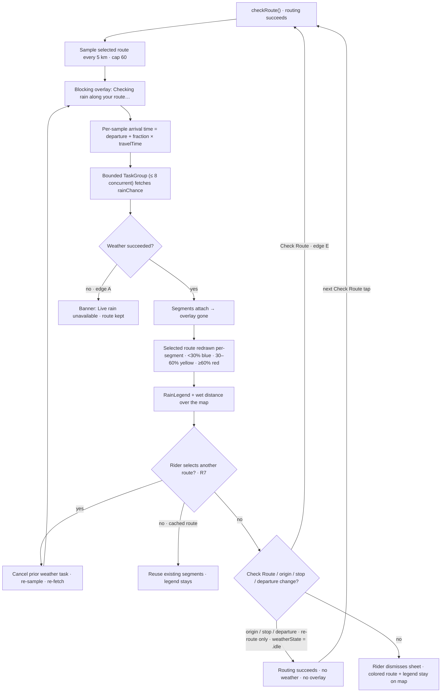

# Flow — Weather Forecast (Rain Layer)

## 1. Related Docs

| Type | Path | Purpose |
|---|---|---|
| Spec | `docs/specs/weather-forecast.md` | Requirements, data model, rules, constraints, acceptance criteria |
| Design | `docs/designs/weather-forecast.md` | Screens, layout, components, accessibility, motion |

## 2. Flow Goal

- User goal: after tapping Check Route, immediately see which parts of the road will be rained on at arrival time, how much of the ride is wet, and re-check when switching routes.
- Start state: trip-planner sheet open with a planned route (`state == .loaded`, route cards + polylines on the map).
- End state: the selected route redrawn as color-coded segments; legend + wet-distance line over the map (or the offline banner); loading overlay gone.
- Success outcome: the rider glances at the map and knows the wet stretches of the selected route before starting.

## 3. Spec Coverage

| Spec ID | Requirement | Covered In Flow Step |
|---|---|---|
| R1 | WeatherKit entitlement + protocol-first `WeatherService` (Live/Mock) | Steps 1, 4 (build/docs) |
| R2 | 5 km sampling, arrival-time forecast, bounded TaskGroup | Steps 2–3 |
| R3 | Blocking loading overlay | Step 2 |
| R4 | Per-segment colored strokes replacing the selected stroke | Steps 4, 6–7 |
| R5 | RainLegend + wet distance | Steps 4, 6–7 |
| R6 | Offline/WeatherKit-fail banner, route kept | Edge case A |
| R7 | Selected-route only; re-select re-fetches (cancel prior) | Steps 5–7 |
| R8 | MVVM + a11y + mocks | Steps 2–7 |
| R9 | Docs updated | This doc |

## 4. Design Coverage

| Design Section | Screen / State | Used In Flow Step |
|---|---|---|
| Design §1 | Loading (weather computing) | Steps 2, 5–6 |
| Design §1 | Loaded (forecast) | Steps 4, 7 |
| Design §1 | Offline / unavailable banner | Edge case A |
| Design §1 | Re-selected route | Steps 5–6 |
| Design §2 | Legend/banner layout | Steps 4, 7, Edge A |
| Design §3 | WeatherLoadingOverlay / RainLegend / RainUnavailableBanner | Steps 2, 4, Edge A |
| Design §5 | VO labels, non-color-only, 44 pt, Dynamic Type, Reduce Motion | Steps 2–7 |

## 5. Main User Journey

1. Rider taps "Check Route" → `checkRoute()` cancels any in-flight task and runs routing, then the rain forecast for the selected route (R1).
2. Routing succeeds → route cards + polylines render; the VM samples the SELECTED route's `coordinatePoints` every 5,000 m (cap 60) and a blocking "Checking rain along your route…" overlay covers the map (R2, R3, R8).
3. The VM derives each sample's arrival time (`departureDate ?? now` + proportional fraction of travel time) and fetches `rainChance` per sample in chunks of ≤ 8 via a bounded TaskGroup (R2).
4. Segments attach to the selected alternative → overlay dismisses → the selected route redraws as per-segment colored strokes (<30% blue / 30–60% yellow / ≥60% red) replacing the plain route-blue stroke; `RainLegend` appears top-leading with chips + wet-distance line (R4, R5).
5. Rider taps a different route card → the VM cancels any in-flight weather task and re-samples/re-fetches for the newly selected route; the legend hides and the loading overlay returns (R7).
6. The new forecast attaches → colored segments + legend update for the new selection (R4, R5).
7. Re-selecting a route that already has segments reuses them instantly (no re-fetch) (R7).
8. Rider dismisses the sheet → the map keeps the colored route + legend; the route-summary pill behaves as in trip-planner (unchanged).
9. Rider taps "Check Route" again → `checkRoute()` cancels the weather task and re-runs routing + weather for the selected route (R7). Changing origin/stop/departure instead calls `plan()`, which re-routes only: it cancels the weather task and resets the forecast to idle (`weatherState = .idle`) — the rider must tap Check Route to forecast again.

## 6. Edge Cases

- **A. WeatherKit failure / offline:** a sample fetch throws → the VM keeps the route and plan, sets `weatherState = .unavailable` → the legend is replaced by the non-blocking "Live rain unavailable" banner; the route draws in plain route-blue; no crash (R6).
- **B. Re-select during an in-flight fetch:** selecting another route cancels the prior weather task before starting the new fetch — stale results never attach (R7).
- **C. Very short route (< 5 km):** sampling emits a single start sample → the whole route renders in that sample's band; wet distance computed against the route's total distance.
- **D. Very long route (> 300 km):** sampling caps at 60 samples (~every 5 km to the cap); the remainder of the route extends the last segment's band.
- **E. Re-plan while weather is loading:** an origin/stop/departure change calls `plan()`, which cancels the weather task, resets the weather state to idle (overlay disappears), and re-runs routing only — no weather and no overlay until the next Check Route tap. A Check Route tap calls `checkRoute()`: it cancels any in-flight task and restarts routing AND weather for the selected route — never a raced duplicate fetch.
- **F. Departure time set:** arrival times offset by `departureDate`; traffic-aware ETA from routing feeds the per-sample fractions (no weather re-scoring — Phase 4).
- **G. Routing failure:** the failed state shows in the cards area (trip-planner behavior); no weather step runs, no overlay, no banner.
- **H. Reduce Motion:** overlay/legend/banner appear instantly; colored strokes swap instantly.
- **I. Route with a stop:** the combined route (stitched legs) is sampled as one polyline — segments span the whole trip including the stop.

## 7. Flow Diagram

