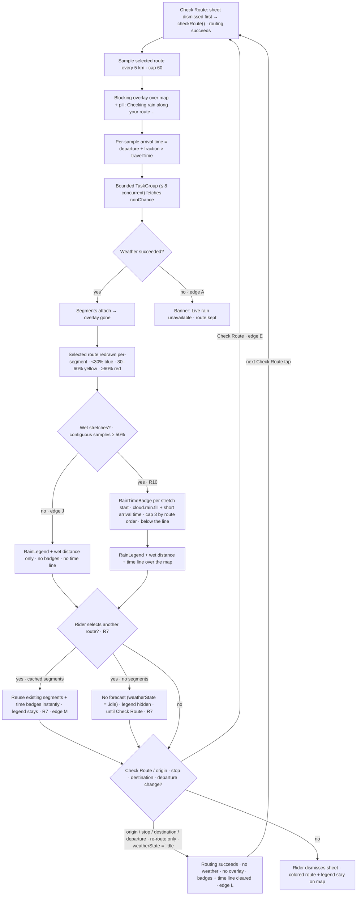

# Flow — Weather Forecast (Rain Layer)

## 1. Related Docs

| Type | Path | Purpose |
|---|---|---|
| Spec | `docs/specs/weather-forecast.md` | Requirements, data model, rules, constraints, acceptance criteria |
| Design | `docs/designs/weather-forecast.md` | Screens, layout, components, accessibility, motion |

## 2. Flow Goal

- User goal: after tapping Check Route, immediately see which parts of the road will be rained on at arrival time, how much of the ride is wet, and what time the rider will arrive at each wet stretch — with weather fetched only on Check Route (no auto-fetch when switching routes).
- Start state: trip-planner sheet open with a planned route (`state == .loaded`, route cards + polylines on the map).
- End state: the selected route redrawn as color-coded segments; legend + wet-distance line + time line over the map, with a time badge at the start of each wet stretch (cap 3) — or the offline banner; loading overlay gone.
- Success outcome: the rider glances at the map and knows the wet stretches of the selected route — and when they'll reach each one — before starting.

## 3. Spec Coverage

| Spec ID | Requirement | Covered In Flow Step |
|---|---|---|
| R1 | WeatherKit entitlement + protocol-first `WeatherService` (Live/Mock) | Steps 1, 4 (build/docs) |
| R2 | 5 km sampling, arrival-time forecast, bounded TaskGroup | Steps 2–3 |
| R3 | Blocking loading overlay; Check Route dismisses the sheet; overlay covers map + pill | Steps 1–2 |
| R4 | Per-segment colored strokes replacing the selected stroke | Steps 4, 6–7 |
| R5 | RainLegend + wet distance | Steps 4, 6–7 |
| R6 | Offline/WeatherKit-fail banner, route kept | Edge case A |
| R7 | Selected-route only; re-select NEVER fetches (cached reuse / `.idle`) | Steps 5, 7, 9 |
| R8 | MVVM + a11y + mocks | Steps 2–7 |
| R9 | Docs updated | This doc |
| R10 | Rain-time markers (badges + legend time line, cap 3, idle-clear, cached instant) | Steps 4, 7, 9, edges J–M |

## 4. Design Coverage

| Design Section | Screen / State | Used In Flow Step |
|---|---|---|
| Design §1 | Loading (weather computing) | Steps 2, 9 |
| Design §1 | Loaded (forecast + time badges + legend time line) | Steps 4, 7 |
| Design §1 | Offline / unavailable banner (no badges, no time line) | Edge case A |
| Design §1 | Re-selected route (no auto-fetch, cached instant) | Steps 5, 7 |
| Design §1 | Departure change (badges + time line cleared) | Step 9, edge L |
| Design §2 | Legend/banner layout | Steps 4, 7, Edge A |
| Design §2 | Time badge + legend time line layout | Steps 4, 7 |
| Design §3 | WeatherLoadingOverlay / RainLegend / RainUnavailableBanner / RainTimeBadge / WetStretch | Steps 2, 4, Edge A |
| Design §5 | VO labels, non-color-only, 44 pt, Dynamic Type, Reduce Motion | Steps 2–7 |

## 5. Main User Journey

1. Rider taps "Check Route" → the trip sheet dismisses first, then `checkRoute()` cancels any in-flight task and runs routing, then the rain forecast for the selected route (R1).
2. Routing succeeds → route cards + polylines render; the VM samples the SELECTED route's `coordinatePoints` every 5,000 m (cap 60) and a blocking "Checking rain along your route…" overlay covers the map and the route-summary pill (R2, R3, R8).
3. The VM derives each sample's arrival time (`departureDate ?? now` + proportional fraction of travel time) and fetches `rainChance` per sample in chunks of ≤ 8 via a bounded TaskGroup (R2).
4. Segments attach to the selected alternative → overlay dismisses → the selected route redraws as per-segment colored strokes (<30% blue / 30–60% yellow / ≥60% red) replacing the plain route-blue stroke; `RainLegend` appears top-leading with chips + wet-distance line + the time line; a `RainTimeBadge` (`cloud.rain.fill` + short arrival time) appears below the route line at the start of each wet stretch, capped at the first 3 by route order (R4, R5, R10).
5. Rider taps a different route card → NO auto-fetch: if that route already has segments they are reused instantly; otherwise the route shows no forecast (`weatherState == .idle`, legend hidden) until the rider taps Check Route (R7).
6. The new forecast attaches → colored segments + legend update for the new selection (R4, R5).
7. Re-selecting a route that already has segments reuses them instantly (no re-fetch) — segments, legend, and time badges render from stored data (R7, R10).
8. Rider dismisses the sheet → the map keeps the colored route + legend; the route-summary pill behaves as in trip-planner (unchanged).
9. Rider taps "Check Route" again → the sheet dismisses first, then `checkRoute()` cancels any in-flight task and re-runs routing + weather for the selected route. Changing origin/stop/destination/departure instead calls `plan()`, which re-routes only: it cancels the weather task and resets the forecast to idle (`weatherState = .idle`) — badges and legend time clear until the rider taps Check Route again (R7, R10).

## 6. Edge Cases

- **A. WeatherKit failure / offline:** a sample fetch throws → the VM keeps the route and plan, sets `weatherState = .unavailable` → the legend is replaced by the non-blocking "Live rain unavailable" banner; the route draws in plain route-blue; no crash (R6).
- **B. Re-select during an in-flight fetch:** re-selecting a route never starts a fetch — a route with cached segments reuses them instantly; an uncached route shows no forecast (`.idle`) while any prior in-flight task continues; stale results never attach to the wrong route (R7).
- **C. Very short route (< 5 km):** sampling emits a single start sample → the whole route renders in that sample's band; wet distance computed against the route's total distance.
- **D. Very long route (> 300 km):** sampling caps at 60 samples (~every 5 km to the cap); the remainder of the route extends the last segment's band.
- **E. Re-plan while weather is loading:** an origin/stop/destination/departure change calls `plan()`, which cancels the weather task, resets the weather state to idle (overlay disappears), and re-runs routing only — no weather and no overlay until the next Check Route tap. A Check Route tap dismisses the sheet and calls `checkRoute()`: it cancels any in-flight task and restarts routing AND weather for the selected route — never a raced duplicate fetch.
- **F. Departure time set:** arrival times offset by `departureDate`; traffic-aware ETA from routing feeds the per-sample fractions (no weather re-scoring — Phase 4).
- **G. Routing failure:** the failed state shows in the cards area (trip-planner behavior); if the sheet was dismissed, the map re-presents the trip sheet so the error + Retry stay reachable (trip-planner edge D); no weather step runs, no overlay, no banner.
- **H. Reduce Motion:** overlay/legend/banner appear instantly; colored strokes swap instantly.
- **I. Route with a stop:** the combined route (stitched legs) is sampled as one polyline — segments span the whole trip including the stop; wet stretches and badges span the whole trip too.
- **J. Zero wet stretches:** no samples reach `rainChance ≥ 0.5` → no `RainTimeBadge` and no legend time line; the legend still shows chips + wet-distance line ("0 km"); the legend VO label omits the rain-time sentence (R10).
- **K. More than 3 wet stretches:** the FIRST 3 by route order (most imminent) get badges; the legend time line shows the 3 times + "+N more" (e.g. "Rain at 2:40 PM · 3:05 PM · 3:30 PM +2 more"); the VO label appends "N more wet stretches." Overlap between nearby badges is accepted — no distance filter (R10).
- **L. Departure change:** `setDepartureDate` → `plan()` → `weatherState = .idle` clears badges + legend time until the next Check Route recomputes — no re-scoring without re-fetch (full departure-time re-scoring is Phase 4) (R10).
- **M. Cached re-select:** re-selecting a route with stored segments renders its badges instantly from stored data (`.loaded`) — same cached data as the colored segments, no re-fetch (R7, R10).

## 7. Flow Diagram

