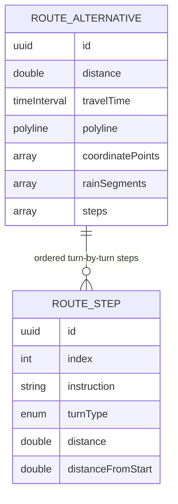

# Spec — Route Detail

## 1. Goal

Once a route is planned and selected in the trip planner, tapping the **already-selected** route card expands the same planner sheet from half-modal (`.medium`) to full (`.large`) and shows a **pre-ride, turn-by-turn preview** of the selected route: each `MKRoute.Step` becomes a row with a turn icon (derived from an English instruction parser), the step's instruction text, and its distance. Wet steps — those whose representative rain chance is **≥ 50%** — additionally show a rain icon and a percentage; dry steps show neither. The header summarizes the ride as **"Rain on X km of Y km"**, computed by the **same shared wet-distance helper** the map legend uses, so the two numbers can never disagree. A back control returns to the route cards with origin/destination/stop/selection/departure preserved. This is a **preview only** — no live turn-by-turn navigation.

## 2. User Problem

- Today the rider sees ETA, distance, and colored rain segments on the map, but cannot see **where the route turns** or **which individual turns are wet**.
- Riders used to Apple/Google Maps expect a route-detail step list before they start riding.
- The rain overlay answers "how much of the ride is wet", not "which turns are wet" — the rider needs the per-turn answer.
- The rider needs a glanceable, glove-friendly pre-ride preview, not live guidance (live navigation is explicitly deferred).

## 3. Requirements

| ID | Requirement | Priority | Notes |
|---|---|---|---|
| R1 | An explicit **"Route details" row in the planner sheet (below the route cards)** is the primary, discoverable entry to the step view: it expands the **same** planner sheet from `.medium` to `.large` and shows the step list — **not** a nested second sheet; re-tapping the already-selected route card remains a shortcut to the same view; a back control returns to the route cards; origin/destination/stop/selection/departure are preserved | P0 | Tapping a **different** card keeps today's select behavior (no expansion); expansion is sheet-local UI state; the Details row shows when `state == .loaded` and a route is selected |
| R2 | Step list for the selected route: one row per step with turn-type icon + instruction text + distance, in route order (first = depart, last = arrive) | P0 | Each row ≥ 44 pt |
| R3 | `RouteTurnType` enum (`depart` / `straight` / `turnLeft` / `turnRight` / `slightLeft` / `slightRight` / `keepLeft` / `keepRight` / `merge` / `roundabout` / `uTurn` / `arrive` / `other`) derived by a deterministic **English instruction parser** over `MKRoute.Step.instructions` | P0 | Ordered matching; first match wins (see §5) |
| R4 | Rain marks: only **wet** steps (representative `rainChance ≥ 0.50`) show a rain icon + %; dry steps show neither; with no forecast, no step shows a mark | P0 | Representative chance = max `rainChance` of the `rainSegments` samples inside the step's distance range (see §5) |
| R5 | Header wet-distance summary reuses the **shared wet-distance helper** (identical to the map legend): "Rain on X km of Y km" | P0 | `RainMetrics.wetDistance(for:)`; X/Y formatted exactly like the legend |
| R6 | No forecast yet → steps shown **without** marks + a "Check route for rain" button that dismisses the planner sheet and then calls the existing `checkRoute()` (same dismiss-then-check behavior as the main Check Route; on routing failure while dismissed the map re-presents the sheet); while the forecast is computing the map shows the blocking overlay; no silent auto-fetch | P0 | Explicit-check weather policy unchanged; expanding the sheet / opening the step view never fetches weather |
| R7 | Weather unavailable → a "Live rain unavailable" note in the header; steps still shown without marks; plan not failed; no crash | P0 | Mirrors the map-level unavailable banner |
| R8 | Routes with a stop (stitched two-leg routes): both legs' steps are concatenated into one ordered list with **continuous cumulative distances** | P0 | Intermediate leg boundary steps are kept in order |
| R9 | Distance alignment: each step's cumulative `distanceFromStart` is scaled so the last step ends exactly at the route's `distance`; the rain→step mapping uses this common distance space | P0 | Nearest-sample fallback when a step range contains no 5 km sample |
| R10 | MVVM: `RouteStep`/`RouteTurnType` models; `DirectionsService` builds `steps` from `MKRoute.steps` (Live + Mock); `TripPlannerViewModel` maps `rainSegments` → per-step representative chance; protocol-first; no comments; mocks in previews | P0 | Per `.opencode/rules/003-project-guideline.md` |
| R11 | Accessibility P0 | P0 | `.opencode/rules/004-accessibility.md`: ≥ 44 pt, VoiceOver, Dynamic Type, Reduce Motion, non-color-only |
| R12 | Docs: `docs/specs/route-detail.md`, `docs/designs/route-detail.md`, `docs/flows/route-detail.md` per templates; `docs/template/spec-guide.md` §9 + `docs/implementation.md` updated | P0 | This docs phase |
| R13 | Preview only: **no** live turn-by-turn navigation, background location, or voice; step-tap map highlight deferred | P0 | Scope guard for the whole branch |

## 4. Data Model

In-memory value types only — **no SwiftData on this branch**:

- **`RouteTurnType`** — the turn category derived from a step's instructions:
  - cases: `depart`, `straight`, `turnLeft`, `turnRight`, `slightLeft`, `slightRight`, `keepLeft`, `keepRight`, `merge`, `roundabout`, `uTurn`, `arrive`, `other`.
- **`RouteStep`** — one turn-by-turn step of a route:
  - `id: UUID`, `index: Int` (route order), `instruction: String`, `turnType: RouteTurnType`
  - `distance: CLLocationDistance` (this step's distance)
  - `distanceFromStart: CLLocationDistance` (cumulative offset, scaled to the route distance — used to map `rainSegments`)
- **`RouteAlternative`** gains `steps: [RouteStep]` (default `[]` so existing inits stay source-compatible).
- **`RainMetrics.wetDistance(for:)`** — the **single shared wet-distance helper** (extracted from the map's existing private logic): sums segment lengths whose `rainChance ≥ 0.5`, with the last segment extending to the route's total distance. Used by both `RainLegend`/`MapScreenView` and the route-detail header.

## 5. Rules / Logic

- **Expansion (Details row / re-tap):** the **"Route details" row** below the route cards is the primary entry; the route card's existing `onTap` lets the sheet distinguish select vs. expand: tapping a **non-selected** card selects it (unchanged); the Details row — or tapping the **already-selected** card (shortcut) — switches the sheet content from route cards to the step list and moves the sheet detent from `.medium` to `.large` (same sheet, no nested presentation). The step list renders the currently selected alternative; the Details row shows only when `state == .loaded` and a route is selected.
- **Back control:** the step view's back button returns to the route cards and collapses the sheet detent to `.medium`; origin/destination/stop/selected route/departure are untouched (no re-route, no re-fetch).
- **Instruction parser (ordered, case-insensitive, first match wins):**
  1. trimmed instructions empty → `other`
  2. contains "arrive" / "destination" → `arrive` (checked before any "left/right" so "Your destination is on the right" is an arrival)
  3. contains "depart" / starts with "head " → `depart`
  4. contains "roundabout" / "exit" → `roundabout`
  5. contains "u-turn" / "u turn" / "uturn" → `uTurn`
  6. contains "merge" → `merge`
  7. contains "keep left" / "keep right" → `keepLeft` / `keepRight`
  8. contains "slight left" / "slight right" / "bear left" / "bear right" → `slightLeft` / `slightRight`
  9. contains "turn left" / "left turn" / "turn right" / "right turn" → `turnLeft` / `turnRight`
  10. contains "continue" / "straight" → `straight`
  11. contains "left" → `turnLeft`; contains "right" → `turnRight`
  12. otherwise → `other`
  - Ordering is load-bearing: arrival and roundabout before plain left/right; u-turn before turn; keep/slight before plain turn; the parser is **English-only** (a non-English locale yields `other`).
  - **First-step override:** a step that parses to `.other` at index 0 (the first/depart step, whose instruction is often a bare "head" or a non-turn phrase) is normalized to `.straight` so the first row shows a forward arrow instead of a generic icon. This override is deliberate and applies only to index 0.
- **Step construction (`DirectionsService`):** map each `MKRoute.Step` in order to a `RouteStep` (`instruction = step.instructions`, `distance = step.distance`, `turnType = parse(step.instructions)`). No stop → the single `MKRoute`'s steps. With a stop → `firstLeg.steps + secondLeg.steps` concatenated in order.
- **Distance alignment:** compute `scale = route.distance / max(Σ step.distance, 1)`; `distanceFromStart` = cumulative sum of preceding steps' distances × `scale`, so the last step's end equals `route.distance`. This puts steps in the same distance space as the rain segments and the shared wet-distance helper.
- **Rain→step mapping:** for each step, range `[distanceFromStart, next step's distanceFromStart)` (the last step ends at `route.distance`). Representative chance = **max** `rainChance` of the `rainSegments` whose `distanceFromStart` falls in that range. If a range contains no sample (short steps vs. 5 km sampling), fall back to the **nearest sample** by `distanceFromStart` to the step's midpoint, so no step is silently unmarked. If `rainSegments` is empty, there is no forecast and no step shows a mark.
- **Wet step:** representative `rainChance ≥ 0.50` → show `cloud.rain.fill` + `Int((chance × 100).rounded())` %. Below 0.50 → show neither (dry). This is the same ≥ 50% concept the map legend uses.
- **Header wet-distance summary:** `RainMetrics.wetDistance(for: selectedAlternative)` rendered as "Rain on X km of Y km" with `X = Int((wet/1000).rounded())`, `Y = Int((total/1000).rounded())` — byte-identical formatting to the map legend, so the two can never disagree. Shown only when a forecast is loaded and `rainSegments` is non-empty.
- **No forecast (idle / empty segments):** steps render without marks; the header area shows a "Check route for rain" button (full-width, ≥ 44 pt) that dismisses the trip sheet and then calls the existing `checkRoute()` — same dismiss-then-check behavior as the main Check Route, and a routing failure while dismissed re-presents the sheet. Expanding the sheet / opening the step view **never** triggers a fetch — weather is explicit-check only.
- **Checking rain:** because "Check route for rain" (like the main Check Route) dismisses the sheet first, the rider sees the map-level blocking overlay ("Checking rain along your route…" over the map and the pill) while `weatherState == .loading`; step marks are withheld. When the forecast attaches, reopening the step view shows marks + the summary. If the fetch fails, the header switches to the unavailable note.
- **Weather unavailable:** `weatherState == .unavailable` → header note "Live rain unavailable"; steps shown without marks; no summary and no "Check route for rain" button (the rider can go back and use the existing Check Route).
- **Empty steps:** if the selected alternative has no steps, the step view shows "Turn-by-turn directions unavailable for this route" plus the back control.
- **State preservation:** expanding, going back, and the sheet's own drag-dismissal never mutate trip state; dismissing the sheet resets the expansion (reopening shows the route cards) while origin/destination/stop/selection/departure remain intact.
- **No silent auto-fetch:** weather is fetched ONLY by `checkRoute()` (the main Check Route or the step view's "Check route for rain"); re-selecting a route never fetches — cached segments are reused, uncached routes show no forecast until an explicit check; the route-detail step view adds no new fetch trigger.

## 6. Constraints

- iOS 26.5+, iPhone-first (landscape supported while mounted).
- Apple frameworks only: SwiftUI, MapKit, CoreLocation, WeatherKit (existing). No third-party packages.
- **Preview only** — no live turn-by-turn navigation, no background location, no voice guidance.
- Instruction parser is **English-only**; other locales degrade to `.other` (generic icon) without crashing.
- Weather stays **explicit-check**: expanding the sheet or viewing steps never fetches; only the "Check route for rain" button (`checkRoute()`) does.
- Selected-route only; no weather for unselected alternatives; no step-tap map highlight (deferred).
- No SwiftData/persistence; no changes to the routing shell beyond building steps and the sheet expansion.
- Reuses the existing 5 km `rainSegments` and the ≥ 50% wet concept; no sampling change.

## 7. Acceptance Criteria

- [ ] `docs/specs/route-detail.md`, `docs/designs/route-detail.md`, `docs/flows/route-detail.md` exist per templates and pass design-review
- [ ] `docs/template/spec-guide.md` §9 showed `fix/ui-enhancements` with the route-detail Models/Services/ViewModels/Views at the time of that branch (historical — §9 is rewritten on every branch switch; current value `fix/clear-destination`)
- [ ] The **"Route details" row** (below the route cards) is the primary entry — it expands the **same** planner sheet `.medium` → `.large` into a step list (no nested sheet); re-tapping the already-selected card stays a shortcut; tapping a different card only selects it
- [ ] Back control returns to the route cards (detent `.medium`) with origin/destination/stop/selection/departure preserved
- [ ] Step list: turn icon + instruction text + distance per step, in route order, ≥ 44 pt
- [ ] `RouteTurnType` parser follows the ordered rules in §5 (English) and maps to all 13 cases; no comments
- [ ] Only wet steps (representative chance ≥ 50%, max sample in the step's range) show a rain icon + %; dry steps show neither
- [ ] Header shows "Rain on X km of Y km" using `RainMetrics.wetDistance(for:)` — identical to the map legend (R5)
- [ ] No forecast → steps without marks + "Check route for rain" button that dismisses the sheet then calls `checkRoute()` (same as the main Check Route; failure re-presents the sheet); map-level checking overlay shown; no silent auto-fetch
- [ ] Weather unavailable → "Live rain unavailable" note in the header; steps shown; plan not failed
- [ ] Routes with a stop concatenate both legs' steps with continuous cumulative distances
- [ ] Empty steps → "Turn-by-turn directions unavailable for this route" + back control
- [ ] Accessibility per `.opencode/rules/004-accessibility.md` (≥ 44 pt, exact VO labels, Dynamic Type, Reduce Motion, non-color-only)
- [ ] `docs/implementation.md` logs this branch's Phase R1 docs entry; scope banner: preview only, no live nav/background location/voice, no step-tap highlight, no SwiftData/persistence
