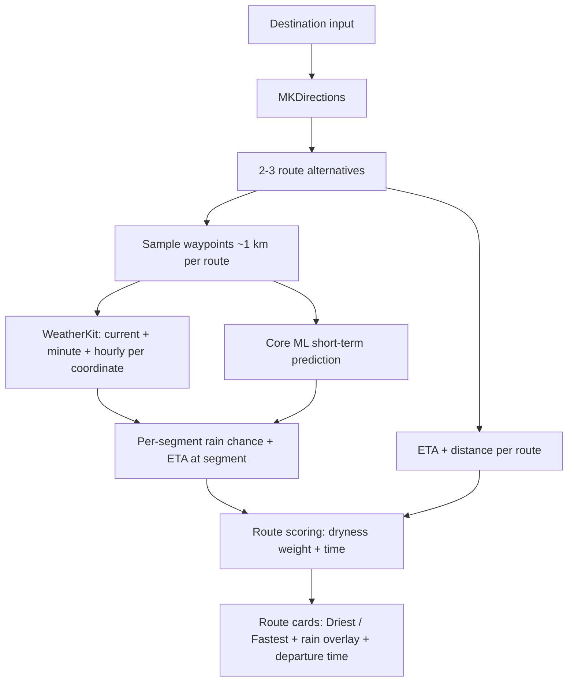

# Spec — Route Rain Overlay (Apple Maps UI/UX)

## 1. Goal

The rider plans a route to a destination on an **Apple Maps-style routing screen** — familiar search, route cards, ETA/distance, route selection — and sees the **rain risk painted directly on the route path**: each route is drawn on the map with color-coded segments showing the chance of rain on that segment when the rider would pass through it. The rider picks the driest route, or takes the fastest route knowingly, with the rainy stretches flagged before they ride.

Why: motorcyclists ride in the rain only by surprise. Apple Maps/Google Maps show *what* is ahead but not *whether it will rain there when they arrive*. Rain Dodger keeps the mental model riders already know and adds the one missing layer — rain on the path, not just rain in general.

## 2. Requirements

| # | Requirement | Priority | Notes |
|---|---|---|---|
| R1 | Apple Maps-style route planning: enter/search destination → app requests 1–3 route alternatives via `MKDirections`, each shown as a map polyline + route card (ETA, distance) | P0 | Familiar interaction; cards selectable; tap to highlight on map |
| R2 | **Rain overlay on the route path**: each route's polyline is split into segments (~1 km samples); each segment is color-coded by rain chance at the rider's estimated arrival time at that segment | P0 | Colors: <30% `rainClear`, 30–60% `rainLight`, >60% `rainHeavy` (spec-guide §6); chance % label on heavy segments |
| R3 | **Driest route ranking**: alternatives ranked by weighted score (ETA + rain exposure); "Driest" badge on the best dry route | P0 | Score = w1 × ETA + w2 × Σ(segment length × rain chance); weights config-tunable |
| R4 | **Fastest route with warning**: fastest route shown as before, but rainy segments flagged and a summary line ("14 km of 40 km with rain ≥ 50%") | P0 | Honest tradeoff: rider chooses dry vs. fast |
| R5 | Route card shows rain risk at a glance (e.g. "Driest" / rain-warning badge) | P0 | Glanceable while mounted; per spec-guide §2 decision flow |
| R6 | Ride start: "Start ride" on the chosen route → turn-by-turn guidance (Apple Maps-style) with rain warnings ahead ("rain in 5 km") | P1 | Warning spoken + visual + haptic before the segment, not during |
| R7 | Departure time suggestion: "leave in 20 min, rain passes in 40 min" based on hourly/minutely forecast along the route | P1 | Uses WeatherKit `MinuteForecast`/hourly at sampled points |
| R8 | Offline/failed-weather degradation: routes still shown without rain overlay, with "live rain unavailable" note | P0 | Route usable; only the weather layer degrades |
| R9 | Rain sampling is per-coordinate on the path (~1 km), not per-destination; cached per route and refreshed when route or departure time changes | P0 | Spec-guide §4 weather data model |

Out of scope (own features): saved destinations, ML-based prediction, community rain reports, radar imagery overlay.

## 3. Data Relations

SwiftData models (registered in the `Schema` in `RainDodgerApp.swift`):

- `Trip` — one planned ride: destination, selected route, departure time, created/updated timestamps.
- `RoutePlan` — one route alternative of a trip: polyline geometry, ETA, distance, score, isSelected. 1–3 per trip.
- `RouteSegment` — one ~1 km slice of a route: coordinate range, rain chance at pass-through time, color bucket. Many per `RoutePlan`.

Weather data is fetched per segment by the `WeatherService` (WeatherKit) and blended with `MLPredictionService` (Core ML, P2); both behind protocols per MVVM.

Data-flow diagram (from spec-guide §4):

## 4. Constraints

- iOS 26.5+, iPhone-first; landscape supported while mounted (spec-guide §8)
- MapKit + WeatherKit only — no third-party weather/radar SDK; no radar imagery tiles (deferred, spec-guide §4)
- Weather sampled every ~1 km along the polyline; sample count bounded for battery/cost (route-length dependent)
- `NSLocationWhenInUseUsageDescription` + WeatherKit entitlement required
- Rain overlay must be distinct from route color in light AND dark mode; ≥ 44 pt hit targets; high contrast
- Offline/error must degrade to R8, never block the route
- No analytics of riding behavior unless user opts in; location + route stay local

## 5. Acceptance Criteria

- [ ] Entering a destination shows 1–3 Apple Maps-style route alternatives with ETA, distance, and selectable cards
- [ ] Each route polyline is drawn with color-coded segments (<30% clear, 30–60% light, >60% heavy) matching the pass-through rain chance
- [ ] The driest route is ranked and badged "Driest"; the fastest route shows its rain warning + wet-distance summary
- [ ] Selecting a route highlights it on the map; "Start ride" begins turn-by-turn guidance
- [ ] Rain warnings announce before the rider reaches a heavy segment (visual + spoken + haptic)
- [ ] With weather unavailable/offline, routes render without overlay plus a "live rain unavailable" note — no crash, no blocked flow
- [ ] Segment rain chances update when departure time or route changes (cache invalidated)
- [ ] All screens pass `.opencode/rules/004-accessibility.md` (VoiceOver, Dynamic Type, contrast 4.5:1/3:1, ≥ 44 pt)