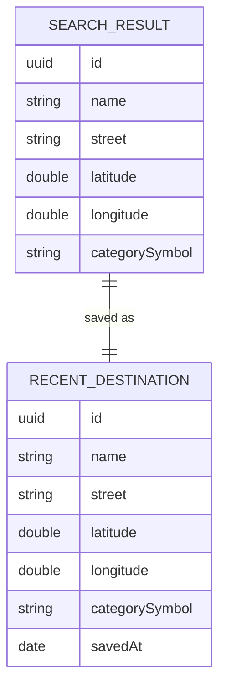

# Spec — Destination Search

## 1. Goal

Let the rider search for a destination by name and pick it to drop a pin on the map. Replaces the maps-screen "coming soon" search stub with a real, MapKit-backed search page presented as a modal sheet: type, get live results, tap to select. Selections are remembered as recents for faster next rides.

## 2. User Problem

- On the maps screen, tapping the search capsule only shows a "coming soon" placeholder — there is no way to actually enter a destination.
- Riders are used to Google Maps / Apple Maps search: type-ahead results, recent destinations.
- No way to set the destination yet, so routing (later) has nothing to hang on.

## 3. Requirements

| ID | Requirement | Priority | Notes |
|---|---|---|---|
| R1 | Search page as a modal sheet | P0 | Presented as a `.sheet` from the maps screen; separate `SearchPage` |
| R2 | Search field pinned at the top of the sheet: magnifier + "Your Destination…" placeholder + decorative mic + in-field clear X when text present | P0 | Auto-focused on appear (set after the sheet settles); in-field clear X only when `!query.isEmpty`; trailing close button always visible (dismisses the sheet); ≥ 44 pt |
| R3 | Live MapKit search while typing | P0 | `MKLocalSearch`, debounced ~350 ms |
| R4 | Result row: circular category icon + bold place name + secondary-gray street name | P0 | Icon derived from `MKPointOfInterestCategory` → SF Symbol |
| R5 | "Recent" header only when recents exist | P0 | Section/header hidden entirely when no recents |
| R6 | Selecting a result saves it as a recent, returns to the map, pins the destination, recenters the camera | P0 | Save-on-select; SwiftData `RecentDestination` |
| R7 | Accessibility | P0 | `.opencode/rules/004-accessibility.md`: ≥ 44 pt targets, VoiceOver labels/hints, Dynamic Type, Reduce Motion, contrast |

## 4. Data Model

Two models:

- **`SearchResult`** — a transient value type representing one search hit (Codable, Hashable, Identifiable):
  - `id: UUID`, `name: String`, `street: String`, `latitude: Double`, `longitude: Double`, `categorySymbol: String`
  - `coordinate: CLLocationCoordinate2D` — computed from the stored Doubles (CoreLocation is imported; the coordinate itself is not stored because `CLLocationCoordinate2D` is not Codable).
- **`RecentDestination`** — a SwiftData `@Model` for persisted recents:
  - `id: UUID`, `name: String`, `street: String`, `latitude: Double`, `longitude: Double`, `categorySymbol: String`, `savedAt: Date`
  - `searchResult: SearchResult` — convenience mapping.

## 5. Rules / Logic

- **Debounce:** `queryChanged` cancels any in-flight search task and starts a fresh one after ~350 ms (`Task.sleep` + cancellation). Empty query cancels and returns to the idle/recents state immediately.
- **Category → symbol:** `MKPointOfInterestCategory` maps to an SF Symbol: restaurant → `fork.knife`, cafe → `cup.and.saucer`, hotel → `bed.double`, gasStation → `fuelpump`, foodMarket/store → `cart.fill`, airport → `airplane`, publicTransport → `bus.fill`, park → `tree.fill`, etc.; default `mappin`.
- **Recents:** save-on-select; most-recent-first; capped at ~10 (oldest dropped); deduped by id (re-saving updates `savedAt`).
- **Header condition:** the "Recent" header and section are rendered only when the recents list is non-empty; empty recents → no header.
- **Select flow:** row tap → `saveRecent(result)` + refresh recents, then the page's `onSelect` callback pins the destination and recenters the camera on the maps screen.

## 6. Constraints

- iOS 26.5+, iPhone-first (landscape supported while mounted).
- Apple frameworks only: SwiftUI, MapKit, CoreLocation, SwiftData. No third-party packages.
- MapKit search requires a network connection; offline shows the error/empty state gracefully.
- Location optional: search uses a region centered on the rider's last known coordinate when available, else a default region.
- `RecentDestination` is registered in the `Schema` in `RainDodgerApp.swift` (template `Item` stays untouched — out of scope).

## 7. Acceptance Criteria

- [ ] `docs/specs/search.md`, `docs/designs/search.md`, `docs/flows/search.md` exist per templates and pass design-review
- [ ] `docs/template/spec-guide.md` §9 shows `feat/search-feature` with Models/Services/ViewModels/Views for the search feature
- [ ] `SearchPage` opens as a modal sheet from the maps search capsule; field pinned at top and auto-focused with magnifier, placeholder, decorative mic, in-field clear X (only when text present), trailing close button dismisses the sheet
- [ ] Live MapKit search while typing (debounced ~350 ms); rows show circular category icon + bold name + secondary-gray street
- [ ] "Recent" header shown only when recents exist; hidden when none
- [ ] Selecting a result saves a recent (SwiftData), returns to the map, pins the destination, recenters the camera
- [ ] `RecentDestination` registered in the `Schema`; `Item` untouched
- [ ] Accessibility per `.opencode/rules/004-accessibility.md` (44 pt targets, VoiceOver labels/hints, Dynamic Type, Reduce Motion)
- [ ] `docs/implementation.md` logs this branch's change entry
- [ ] Maps-screen docs' "search stub" references point to the new search docs
