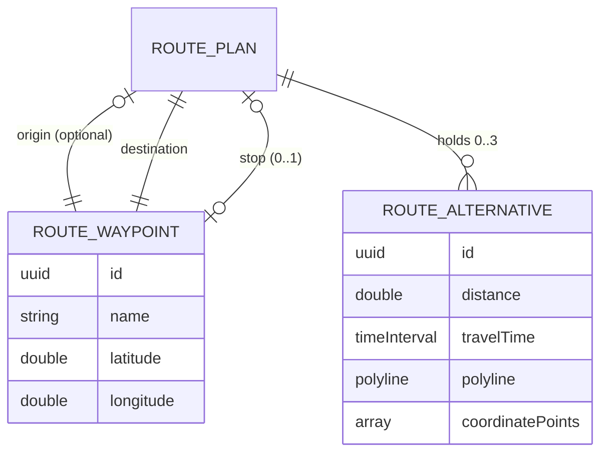

# Spec — Trip Planner

## 1. Goal

Once the rider picks a destination in the search page (pick = confirm), the app returns to the map, drops the pin, and **auto-opens a Google Maps–style half-modal "Direction" sheet**: an origin row ("My Location", defaults to the current location, editable through the existing search page), the confirmed destination (category icon, read-only in the sheet), one "Add stop" slot, a "Leave at" row (tappable "Now" pill → date+time picker sheet setting `departureDate`), and a "Check Route" button (re-runs the plan). The route is drawn on the map as 2–3 MKDirections alternatives, and the sheet shows a selectable route card per alternative with ETA + distance, PLUS map badges (white ETA pill at the destination, blue "X min Fastest" badge on the selected route). No weather yet — this branch delivers the routing shell only.

## 2. User Problem

- Today picking a destination only pins the map and recenters the camera — there is no route, so a rider planning a trip has to leave the app and switch to Google Maps / Apple Maps for routing.
- Riders are used to the Google/Apple Maps flow: pick a destination → route options (ETA + distance) appear immediately in a half-sheet with the route drawn on the map.
- There is no way to plan a multi-leg trip (one intermediate stop) yet, and no route state to hang the Phase 3 rain layer on.

## 3. Requirements

| ID | Requirement | Priority | Notes |
|---|---|---|---|
| R1 | "Direction" half-modal sheet auto-opens immediately when a destination is picked in the search page (pick = confirm); the trip rows sit in a grouped card; it dismisses by dragging down only (drag indicator, **no close button**), and dismissing keeps everything on the map as-is while the route-summary pill (R13) floats over it — tapping the pill reopens the sheet with all state preserved | P0 | Detents medium/large, drag indicator visible (drag-to-dismiss); dismissed sheet → map unchanged (route alternatives, selection, pins, camera) + route-summary pill bottom-center |
| R2 | Origin row label "My Location" (default = current location when known; editable through the existing `SearchPage` in "where from?" mode); leading blue navigation-arrow icon; trailing decorative drag-handle (non-functional) | P0 | Value = current location by default; edited only via "where from?" search |
| R3 | Destination row shows the category icon (orange per the search result's category) + the confirmed destination name, read-only in the sheet | P0 | Changed only by closing the sheet and picking a new destination; icon reuses `SearchResult.categorySymbol` |
| R4 | One "Add stop" row with a blue plus icon: add via search, remove via X (≥ 44 pt); trailing decorative drag-handle | P0 | Adding/removing re-routes; max 1 stop; remove X ≥ 44 pt |
| R5 | MKDirections route alternatives drawn on the map | P0 | No stop → one request with source/destination + `requestsAlternateRoutes = true`, `transportType = .automobile`, returning 2–3 alternatives; stop present → two leg requests (origin→stop, stop→destination) stitched into one combined route (summed ETA/distance, concatenated polyline), so with a stop the rider gets 1 combined route. Zero routes = failed state |
| R6 | Route cards: ETA + distance per alternative, selectable | P0 | Each card ≥ 44 pt |
| R7 | Selected route highlighted on the map (thicker/brighter), others muted; camera fits origin → stop → destination | P0 | Selection updates map styling + camera |
| R8 | Changing origin/stop re-runs routing and refits the camera | P0 | |
| R9 | Edge cases handled gracefully | P0 | See flow doc edge cases A–Q |
| R10 | MVVM: protocol-first `DirectionsService` (Live + Mock), `@MainActor @Observable` `TripPlannerViewModel`, no comments | P0 | Per `.opencode/rules/003-project-guideline.md` |
| R11 | Accessibility P0 | P0 | `.opencode/rules/004-accessibility.md`: 44 pt targets, VoiceOver, Dynamic Type, Reduce Motion |
| R12 | Docs + spec-guide §9 + implementation log updated | P0 | This docs phase |
| R13 | Route-summary pill: shown while the sheet is dismissed and routing has not failed; shows the selected route's ETA·distance once a plan exists, "Calculating…" while a request is in flight | P0 | Tapping the pill reopens the sheet preserving origin/destination/stop/selection; reads "Calculating…" while routing is still loading; floats bottom-center above the safe area, ≥ 44 pt; see Rules/Logic + flow edge cases J–K |
| R14 | Map badges: a white ETA pill attached to the destination marker (selected route's ETA, e.g. "39 min") and a blue "X min Fastest" badge on the selected route polyline | P0 | Both update when the selected route changes; both a11y-hidden because the same ETA/distance is already exposed by the route cards and the destination ETA pill duplicates card info |
| R15 | "Leave at" row with a gray pill ("Now" or the chosen time): tappable → `DepartureTimePickerSheet` (Apple Maps "Leave at" style, `.large` sheet): header X (cancel, no re-plan) · "Leave at" · blue up-arrow (apply); `.graphical` date-only calendar (min = today, past days disabled); "Time" row + capsule pill opening a nested `.height(300)` wheel hour+minute sub-sheet (blue "Done" commits the wheel draft into the picker draft); "Leave Now" row. Draft-commit: date/time changes are picker-local drafts; re-route happens ONLY on arrow-apply (`setDepartureDate(draftDate)`) or "Leave Now" (`setDepartureDate(nil)`); X/swipe-dismiss cancels with no re-plan. Applied departure runs routing with `MKDirectionsRequest.departureDate` (traffic-aware ETA) | P0 | VM `setDepartureDate` stays the single commit point (clamps past → now); "Leave now" resets to Now; draft default = `departureDate ?? Date()` (now's time, time preserved on date change); no weather re-scoring on this branch (Phase 4) |
| R16 | "Check Route" button: full-width blue, motorcycle icon, ≥ 44 pt; re-runs `plan()` (idempotent refresh that doubles as Retry) | P0 | Auto-plan on destination pick unchanged; tapping while loading cancels + restarts the plan |

## 4. Data Model

In-memory value types only — **no SwiftData on this branch**:

- **`RouteWaypoint`** — one point of the trip (origin, destination, or stop):
  - `id: UUID`, `name: String`, `latitude: Double`, `longitude: Double`
  - `coordinate: CLLocationCoordinate2D` — computed from the stored Doubles (CoreLocation is imported; the coordinate itself is not stored because `CLLocationCoordinate2D` is not Codable).
- **`RouteAlternative`** — one returned route:
  - `id: UUID`, `distance: CLLocationDistance`, `travelTime: TimeInterval`
  - `polyline: MKPolyline` — the drawn map overlay.
  - `coordinatePoints: [CLLocationCoordinate2D]` — sampled path for camera fitting (and later rain sampling in Phase 3).
- **`RoutePlan`** — the trip state owned by `TripPlannerViewModel`:
  - `origin: RouteWaypoint?` — nil when location is denied/unknown (origin UNSET).
  - `destination: RouteWaypoint`, `stop: RouteWaypoint?`
  - `alternatives: [RouteAlternative]`, `selectedRouteID: UUID?`

**No new persisted types on this branch.** `departureDate: Date?` is **not** part of any model — it lives on `TripPlannerViewModel` and is passed to `MKDirectionsRequest.departureDate` at request time (`nil` = leave now). It is never stored (no persistence on this branch).

## 5. Rules / Logic

- **Origin default:** when location is known → origin row reads "My Location" (backed by a current-location waypoint); when location is denied/unknown → origin stays **UNSET** and the sheet shows a "Set origin" row — the sheet still auto-opens, but **no route is requested** until the rider picks an origin.
- **Routing request:** no stop → one `MKDirections.Request` with `source`, `destination`, `requestsAlternateRoutes = true`, `transportType = .automobile`; every alternative Apple returns is kept (2–3). Stop present → two leg requests (origin→stop, stop→destination), each `requestsAlternateRoutes = true`, `.automobile`; the first/best `MKRoute` of each leg is stitched into ONE combined route — distance and travel time summed, polyline built from the concatenated leg polylines — so the rider gets exactly 1 combined route with a stop. Zero routes returned = failed state.
- **Selection:** the first returned alternative is selected by default; tapping a card sets `selectedRouteID`; the selected route draws thicker/brighter, others muted; the camera fits origin → stop → destination.
- **Re-route:** changing origin or adding/removing the stop re-runs routing and refits the camera.
- **Guards (graceful message, no route):** origin == destination; stop == destination; stop == origin.
- **Failure:** routing error/offline → `failed` state with a Retry action.
- **Pill visibility:** the route-summary pill shows while the sheet is dismissed and routing has not failed; it shows the selected route's ETA·distance once a plan exists and "Calculating…" while a request is in flight; the pill is hidden while the sheet is open or when routing failed.
- **Pill content:** "X min · Y km" for the currently selected route (first returned alternative by default, or whichever card the rider picked). If the sheet is dismissed while a routing request is still in flight, the pill reads "Calculating…" and updates to the loaded result when the request returns — the sheet stays closed until the rider taps the pill.
- **Reopen preserves state:** tapping the pill reopens the half-sheet with all state intact (origin, destination, stop, selected route, alternatives) and does not re-run routing; a re-route happens only after an origin/stop change inside the reopened sheet.
- **Departure time (`departureDate`):** default `nil` (leave now). The picker edits a picker-local draft date/time (default = `departureDate ?? Date()`, so the time component starts as now and date changes preserve it) and re-plans ONLY when the rider applies via the blue up-arrow (`setDepartureDate(draftDate)`) or taps "Leave Now" (`setDepartureDate(nil)`); dismissing/cancelling the picker (X/swipe) makes no VM call, so `departureDate` is untouched (draft-commit). An applied departure triggers a re-plan with `MKDirectionsRequest.departureDate = departureDate` for traffic-aware ETA/distance; "Leave now" resets to `nil` and re-plans with no departure date. The calendar's minimum selectable date is today (past days disabled); if an applied draft is still in the past (a time earlier today), `setDepartureDate` clamps it to now. `plan()` cancels any in-flight request before re-running. **No weather re-scoring** happens on this branch (Phase 4).
- **Map badges:** the white ETA pill at the destination marker shows the selected route's travel time ("X min"); the blue route badge shows the selected route's "X min Fastest". Both update whenever the selection changes; both are `accessibilityHidden` because the same ETA/distance is already exposed by the route cards and the destination pill duplicates card info.
- **Check Route button:** full-width blue button re-runs `plan()` — idempotent (same trip → same plan) and doubles as Retry after a failure; tapping while a request is in flight cancels and restarts. Auto-plan on destination pick is unchanged.
- **Decorative drag-handles:** the hamburger (≡) handles on the origin/destination/add-stop rows are decorative only — tapping them does nothing (reordering is out of scope).
- **Persistence:** none — `RoutePlan` lives only in the ViewModel while the sheet is open.

## 6. Constraints

- iOS 26.5+, iPhone-first (landscape supported while mounted).
- Apple frameworks only: SwiftUI, MapKit, CoreLocation. No third-party packages.
- No weather/rain layer (Phase 3); no departure-time optimization (Phase 4).
- No `SavedDestination`/`Trip` SwiftData models; `RecentDestination` (search feature) untouched; template `Item` untouched.
- No persistence of route plans.
- Driving only: `transportType .automobile`, no transport-mode picker.
- The departure picker sets `departureDate` only (traffic-aware ETA) — no weather re-scoring this branch; re-scoring routes against rain on a chosen departure time remains Phase 4. Transport mode stays `.automobile` regardless of the chosen departure time.
- Max 1 intermediate stop.
- Routing requires a network connection; offline shows the failed state gracefully with Retry.

## 7. Acceptance Criteria

- [ ] `docs/specs/trip-planner.md`, `docs/designs/trip-planner.md`, `docs/flows/trip-planner.md` exist per templates and pass design-review
- [ ] `docs/template/spec-guide.md` §9 shows `feat/destination` with trip-planner Models/Services/ViewModels/Views
- [ ] Picking a destination returns to the map, drops the pin, and auto-opens the half-sheet with origin (current location or "Set origin"), destination, and one Add-stop slot
- [ ] Origin row editable through the existing `SearchPage` in "where from?" mode; destination read-only in the sheet
- [ ] One stop slot: add via search, remove via X; max 1 stop; changes re-route + refit
- [ ] 2–3 MKDirections alternatives drawn on the map with no stop (single request, `requestsAlternateRoutes`, `.automobile`); with a stop, two leg requests stitched into one combined route (1 card, summed ETA/distance, concatenated polyline); 0 = failed
- [ ] Route cards show ETA + distance, selectable, ≥ 44 pt; selected route highlighted, others muted; camera fits origin → stop → destination
- [ ] Sheet dismisses by dragging down (no close button); the map keeps the route/selection/pins/camera as-is and the route-summary pill shows the selected route's ETA + distance ("Calculating…" while loading); tapping it reopens the sheet with origin/destination/stop/selection preserved
- [ ] Map badges: white ETA pill at the destination marker (selected route's ETA) + blue "X min Fastest" badge on the selected route; both update on selection change; both a11y-hidden (R14)
- [ ] "Leave at" row shows a gray "Now"/time pill; tapping opens the Apple Maps–style `DepartureTimePickerSheet` (`.large` sheet: X · "Leave at" · blue up-arrow header, `.graphical` date-only calendar min = today, Time row + nested wheel sub-sheet with Done, Leave Now); draft-commit — re-plan only on arrow-apply or "Leave Now", X/swipe cancels without a re-plan; applied departure re-runs routing with `MKDirectionsRequest.departureDate` for traffic-aware ETA; past dates disabled and a past applied time clamped to now; no weather re-scoring (R15)
- [ ] "Check Route" button (full-width blue, motorcycle icon, ≥ 44 pt) re-runs `plan()` idempotently; doubles as Retry; tapping while loading cancels + restarts; auto-plan on destination pick unchanged (R16)
- [ ] Edge cases A–Q per `docs/flows/trip-planner.md`
- [ ] Accessibility per `.opencode/rules/004-accessibility.md` (44 pt targets, VoiceOver labels, Dynamic Type, Reduce Motion)
- [ ] `docs/implementation.md` logs this branch's entry; scope banner: no weather, no SavedDestination/Trip SwiftData, no persistence, no transport modes, max 1 stop