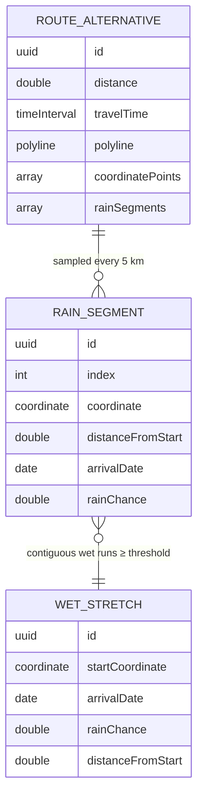

# Spec — Weather Forecast (Rain Layer)

## 1. Goal

After the rider taps "Check Route", Rain Dodger computes a rainfall forecast along the **selected** route over time: the route path is sampled every 5 km, each sample gets the precipitation probability at the rider's estimated arrival time, and the route is redrawn on the map as color-coded segments (<30% route-blue, 30–60% yellow, ≥60% red) with a legend and a wet-distance summary — plus a small time badge at the start of each wet stretch showing the rider's estimated ARRIVAL time there — so the rider can see at a glance where the road will be rained on **and when they'll get there**.

## 2. User Problem

- A rider planning a trip has no idea which parts of the route will be raining when they arrive — today they only get ETA and distance.
- Weather apps report the destination's weather, not the weather along the path at the time the rider passes each point.
- The rider needs a glanceable, glove-friendly answer: "is this stretch of road wet when I get there, and how much of the ride is wet?"

## 3. Requirements

| ID | Requirement | Priority | Notes |
|---|---|---|---|
| R1 | WeatherKit entitlement `com.apple.developer.weatherkit` present; protocol-first `WeatherService` (Live + Mock) | P0 | Mock = deterministic scripted probabilities for previews/tests |
| R2 | Selected route's polyline sampled every 5,000 m (cap ~60 samples); each sample's arrival time = `departureDate ?? now` + proportional fraction of travel time; `rainChance` fetched per sample in a bounded TaskGroup (chunked ≤ 8 concurrent) | P0 | Arrival-time forecast per point |
| R3 | Blocking full-map loading overlay "Checking rain along your route…" while weather computes | P0 | Non-dismissable; present over the map and the route-summary pill only; Check Route dismisses the trip sheet before the overlay appears |
| R4 | Selected route drawn as per-segment colored strokes REPLACING the route-blue stroke: <30% route-blue, 30–60% yellow, ≥60% red; unselected alternatives stay muted blue as today | P0 | Band mapping shared with the legend |
| R5 | `RainLegend` over the map: "Dry / Light / Heavy rain" chips with % ranges + wet-distance line ("14 km of 40 km with rain ≥ 50%") | P0 | Text not color-only |
| R6 | Weather failure/offline degrades to a non-blocking "live rain unavailable" banner in place of the legend; route fully shown, no crash, plan NOT failed | P0 | |
| R7 | Weather computed for the selected route only; re-selecting a route NEVER auto-fetches — a route with cached segments reuses them (weatherState `.loaded`), one without segments shows no forecast (`.idle`) until the rider taps Check Route | P0 | No weather on unselected alternatives; no auto re-fetch on re-selection |
| R8 | MVVM: `@MainActor @Observable` `TripPlannerViewModel` injects `WeatherService`; no comments; accessibility per `.opencode/rules/004-accessibility.md`; mocks in all previews | P0 | |
| R9 | Docs: spec/design/flow per templates; `docs/template/spec-guide.md` §9 + `docs/implementation.md` updated | P0 | |
| R10 | Rain-time markers: one small map badge at the start of each wet stretch (contiguous samples with `rainChance ≥ RainMetrics.wetThreshold`) showing the rider's estimated ARRIVAL time there, locale-aware short time; cap 3 badges (first 3 wet stretches by route order); recomputed only by the next Check Route — a departure/route change clears badges and legend time via the existing idle reset; cached re-select renders badges instantly from stored data | P0 | Badge = `cloud.rain.fill` + short time (e.g. "2:40 PM"; 24h locales "14:40"); NO "Rain" word on the badge; the legend counts the rest ("+N more") |

## 4. Data Model

In-memory value types only — **no SwiftData on this branch**:

- **`RainSegment`** — one forecast sample along the route:
  - `id: UUID`, `index: Int` (sample ordinal), `coordinate: CLLocationCoordinate2D`, `distanceFromStart: CLLocationDistance`, `arrivalDate: Date` (the exact sampled arrival), `rainChance: Double` (0–1).
- **`WetStretch`** (new value type) — one contiguous run of wet samples (`rainChance ≥ RainMetrics.wetThreshold`), derived from `rainSegments` (never stored), used to place the time badges:
  - `id: Int` (index of the run's first wet sample — stable identity across renders and re-fetches), `startCoordinate: CLLocationCoordinate2D`, `arrivalDate: Date` (arrival at the stretch start — the exact time the forecast was sampled for), `rainChance: Double` (representative/max of the stretch), `distanceFromStart: CLLocationDistance` (of the stretch start).
- **`RouteAlternative`** gains `rainSegments: [RainSegment]` (default `[]` so existing inits stay source-compatible); wet stretches are computed via `RainMetrics.wetStretches(for:)` — not stored.

## 5. Rules / Logic

- **Sampling:** walk the selected route's `coordinatePoints` accumulating haversine distance; emit a sample every 5,000 m (the first point is always included; capped at 60 samples).
- **Arrival time per sample:** `departure = departureDate ?? Date()`; `arrival = departure + (distanceFromStart / max(totalDistance, lastSampleDistance)) × travelTime`.
- **Concurrency:** samples fetched in chunks of ≤ 8 via `withThrowingTaskGroup` (bounded); results sorted by `index` before attaching.
- **Bands:** < 0.30 = Dry (route-blue), 0.30–0.60 = Light (yellow), ≥ 0.60 = Heavy rain (red).
- **Wet distance:** sum of segment lengths whose `rainChance ≥ 0.5`; segment length = next sample's `distanceFromStart − this sample's`, and the last segment extends to the route's total distance.
- **Wet stretch grouping:** a contiguous run of samples with `rainChance ≥ RainMetrics.wetThreshold` (0.5) forms ONE wet stretch, starting at the first wet sample's coordinate; that sample's `arrivalDate` (the exact time the forecast was sampled for) is the stretch's arrival time. A single dry sample splits two wet runs into two stretches.
- **Time badges:** one badge per wet stretch, placed at the stretch-start coordinate; capped at 3 — the FIRST 3 wet stretches by route order (most imminent); the legend counts the rest. Badge shows `cloud.rain.fill` + the stretch's arrival time, locale-aware short time (e.g. "2:40 PM"; 24h locales "14:40") — no "Rain" word on the badge.
- **Time formatting:** locale-aware short time (`Date.FormatStyle` hour/minute) — never a hardcoded "AM/PM" string.
- **Overlap accepted:** two nearby wet stretches may overlap badges on the map; no distance filter — bounded only by the cap.
- **Departure change:** `setDepartureDate` → `plan()` → `weatherState = .idle` — badges and legend time clear until the next Check Route recomputes (no re-scoring without re-fetch; full departure-time re-scoring is Phase 4).
- **Weather failure:** catch the error, keep the route and plan, set `weatherState = .unavailable` → banner. Never fail the plan.
- **Re-selection:** selecting another route card NEVER fetches — a route with cached segments reuses them (weatherState `.loaded`, instant, badges + legend time included); a route without segments shows no forecast (weatherState `.idle`) until the rider taps Check Route. An in-flight fetch from a prior Check Route continues and its results attach only to the route it was requested for — never to a newly selected route.
- **Re-plan:** an automatic re-route (destination/origin/stop/departure change) cancels the in-flight weather task, resets the weather state to idle, and re-runs routing only — no forecast until the rider taps Check Route again.
- **Destination clear:** clearing the destination (trip-planner R17/R18) resets `weatherState` to `.idle` and removes all rain overlays, the legend, and the time badges with the rest of the destination-only reset.
- **Trigger:** weather is fetched ONLY by `checkRoute()` (the Check Route tap); re-selecting a route never fetches.

## 6. Constraints

- iOS 26.5+, iPhone-first; Apple frameworks only (WeatherKit + existing MapKit/CoreLocation/SwiftUI).
- WeatherKit entitlement required; API budget ≈ 500k calls/month → 5 km sampling + ~60-sample cap bounds per-route cost; no caching/persistence this branch.
- Selected-route-only; no dry-route ranking / departure-time sweep (Phase 4).
- Live WeatherKit may return no data on the simulator → device-only manual validation; mock-verifiable path now.
- Offline/WeatherKit failure must degrade gracefully (banner, route still shown).
- No SwiftData/persistence; no changes to the trip-planner routing shell beyond wiring weather in.

## 7. Acceptance Criteria

- [ ] `com.apple.developer.weatherkit` present in `RainDodger/RainDodger.entitlements`; build passes via `.opencode/scripts/xcode-tools.sh build`
- [ ] `WeatherService` protocol + `LiveWeatherService` (WeatherKit) + `MockWeatherService` (deterministic scripted probabilities); no comments
- [ ] Check Route → routing succeeds → blocking "Checking rain along your route…" overlay → selected route sampled every 5 km (cap 60) → per-segment colors + legend + wet distance on the selected route only
- [ ] Picking a destination / changing origin/stop/departure auto-plans routing with NO weather and no overlay; Check Route dismisses the trip sheet first and the blocking overlay covers the map and the pill; only tapping Check Route starts the forecast.
- [ ] Legend chips "Dry / Light / Heavy rain" + % ranges + "X km of Y km with rain ≥ 50%"; not color-only
- [ ] WeatherKit failure/offline → non-blocking "live rain unavailable" banner in place of the legend; route fully shown; plan not failed
- [ ] Re-selecting a route NEVER fetches: cached segments reused instantly (`.loaded`); a route without segments shows none (`.idle`) until Check Route is tapped
- [ ] After Check Route, one `RainTimeBadge` per wet stretch at the stretch start: `cloud.rain.fill` + locale-aware short arrival time (e.g. "2:40 PM" / "14:40"); at most 3 badges (first 3 wet stretches by route order); the legend time line lists the capped times + "+N more" for the rest
- [ ] Departure/route change (`setDepartureDate`/`plan()`) clears badges + legend time via the existing idle reset until the next Check Route recomputes — no re-scoring without re-fetch
- [ ] Re-selecting a route with cached segments renders its badges instantly from stored data (`.loaded`); a route with no wet stretches shows no badges and no legend time line
- [ ] Badges are decorative (`.accessibilityHidden(true)`); the legend's single combined VO label carries the capped times + remainder count (exact wording per design §5)
- [ ] A11y per `.opencode/rules/004-accessibility.md`: VO labels, non-color-only, ≥44 pt, Dynamic Type, Reduce Motion
- [ ] `TripPlannerViewModel` injects `weatherService`; `ContentView` injects `LiveWeatherService`; all `#Preview`s use `MockWeatherService`
- [ ] Docs: `docs/specs/weather-forecast.md`, `docs/designs/weather-forecast.md`, `docs/flows/weather-forecast.md` per templates; `docs/template/spec-guide.md` §9 + `docs/implementation.md` updated