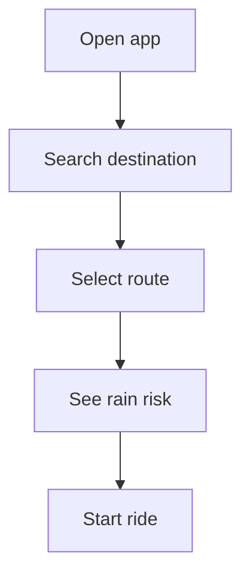

# Flow — <Feature Name>

_Usage: copy to `docs/flows/<feature>.md`, rename, and fill in._

Guiding questions: How does the rider move through the feature? Which spec requirement happens at each step? What app state changes? What edge cases appear?

## 1. Main Journey

1. User opens app
2. Searches destination
3. Selects route
4. Sees rain risk
5. Starts ride

## 2. Flow Diagram

Use Mermaid for user flow, not implementation detail:

## 3. Events and State Changes

| Event | App State | Result |
|---|---|---|
| User types destination | loading | Search suggestions appear |
| User selects destination | loading routes | Map requests route alternatives |
| Weather fails | loadedWithoutWeather | Show route, hide rain overlay |

## 4. Edge Cases

Permission denied, no network, no route, rain data unavailable, user changes destination quickly.