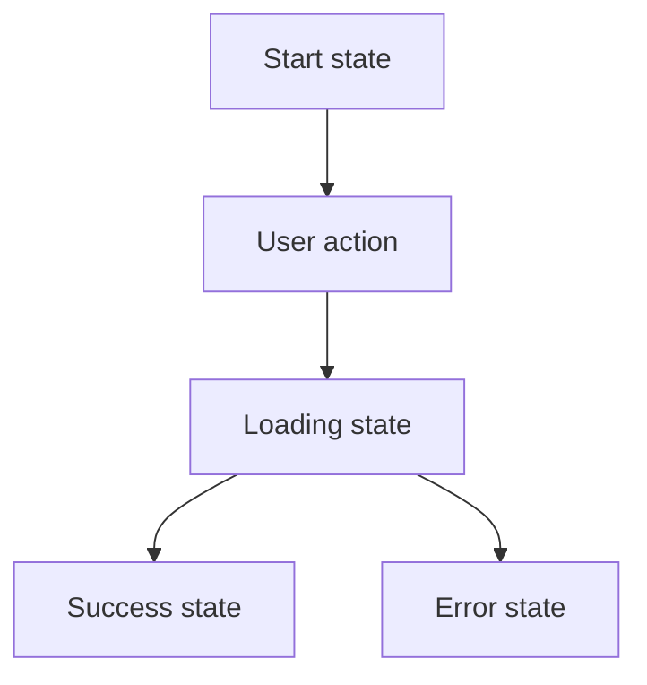

# Flow — <Feature Name>

_Usage: copy to `docs/flows/<feature>.md`, rename, and fill in._

Guiding questions: How does the rider move through the feature? Which spec requirement happens at each step? What design state is on screen? What edge cases appear?

## 1. Related Docs

| Type | Path | Purpose |
|---|---|---|
| Spec | `docs/specs/<feature>.md` | Requirements, data, constraints, acceptance criteria |
| Design | `docs/designs/<feature>.md` | Screens, UI states, accessibility, interactions |

## 2. Flow Goal

- User goal:
- Start state:
- End state:
- Success outcome:

## 3. Spec Coverage

_Link this flow to specific requirements from the spec._

| Spec ID | Requirement | Covered In Flow Step |
|---|---|---|
| R1 | TBD | Step 1 |
| R2 | TBD | Step 3 |

## 4. Design Coverage

_Link this flow to screens and states from the design doc._

| Design Section | Screen / State | Used In Flow Step |
|---|---|---|
| Design §2 | Empty state | Step 1 |
| Design §2 | Loading state | Step 2 |
| Design §2 | Loaded state | Step 3 |
| Design §2 | Error state | Edge Case 1 |

## 5. Main User Journey

1. TBD
2. TBD
3. TBD

## 6. Flow Diagram

